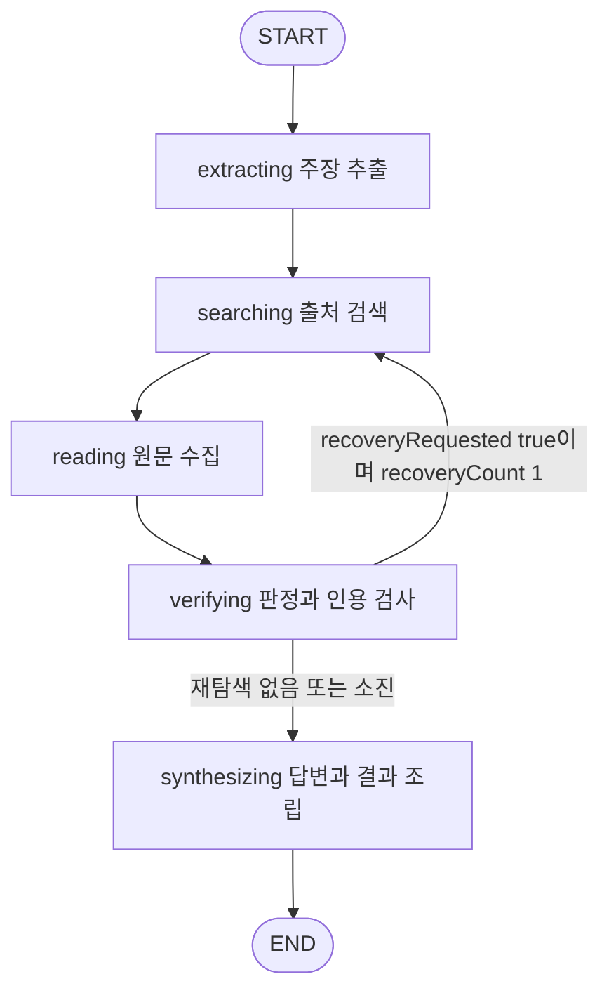

# True or Not Agent State Node 설계서

기준일: 2026-10-08. 코드 기준: `feat/search`의 `0d9a690423a5bcb5ae92e46c6bc370bca5b98235`. 대상 독자는 검증 엔진과 API를 개발·검토하는 담당자입니다.

True or Not의 메인 팩트체크 Agent는 요청마다 하나의 `FactCheckState`를 생성하고, 다섯 Node에서 주장·출처·근거·답변을 순서대로 갱신합니다. 판정 후 원문 접근 또는 인용 문제가 확인되면 최대 한 번 검색으로 돌아갑니다. 이 설계서는 현재 구현의 State 계약, Node 책임과 실행 경계를 설명합니다. 제품 정책과 남은 작업은 [기획서](기획서.md)와 [작업현황](작업현황.md)을 따릅니다.

## 1 적용 범위와 구성

| 구성 | 코드 | 책임 |
|---|---|---|
| State와 그래프 | [workflow.py](../backend/workflow.py) | `FactCheckState`, `Stage`, Node 등록과 조건부 Edge를 정의합니다. |
| 런타임 조립 | [runtime.py](../backend/runtime.py) | 서비스 어댑터를 연결하고 초기화·제외 URL 검사·재탐색·최종 결과 조립을 처리합니다. |
| 단계별 처리 | [extraction.py](../backend/extraction.py), [search.py](../backend/search.py), [sources.py](../backend/sources.py), [verification.py](../backend/verification.py), [answer_synthesis.py](../backend/answer_synthesis.py) | 추출·검색·수집·판정·답변 구성을 수행합니다. |
| 재탐색 판단 | [recovery.py](../backend/recovery.py) | 판정 이후 복귀 조건과 대상·검색어·제외 URL을 결정합니다. |
| API와 스트림 | [main.py](../backend/main.py), [streaming.py](../backend/streaming.py) | 입력·최종 응답을 검증하고 NDJSON 이벤트를 전달합니다. |
| 공개 계약 | [schemas.py](../backend/schemas.py), [contracts.py](../backend/contracts.py), [fact-check-contract.ts](../app/lib/fact-check-contract.ts) | 요청과 응답의 자료형·길이·참조 무결성을 정의합니다. |

`build_workflow()`는 주입된 단계 함수를 연결하고, `build_runtime_workflow()`는 실제 서비스 처리를 감싼 Node 함수를 공급합니다. Node 내부의 검색·수집 도구 호출 순서와 재탐색 조건은 Python 코드로 정해집니다. `review_recovery()`와 `build_fact_check_result()`는 Node 안에서 실행하는 함수입니다.

다음 경로는 메인 StateGraph와 실행 경계를 구분해야 합니다.

| 경로 | 메인 그래프와의 관계 |
|---|---|
| `POST /api/fact-check/stream` | 메인 그래프를 실행하고 NDJSON을 반환합니다. 브라우저는 Next.js 프록시를 거칩니다. |
| `POST /api/fact-check` | 같은 메인 그래프를 실행하고 `{result: ...}` JSON을 반환합니다. |
| `POST /api/fact-check/jev` | `run_jev_fast_check()`가 별도로 실행됩니다. 메인 그래프의 다섯 Node와 재탐색 루프를 사용하지 않습니다. |
| intent·내용 요약 | 별도 API 함수입니다. 메인 그래프 진입 전 화면에서 분기합니다. |
| 대화 저장·복원 | 별도 API와 PostgreSQL 저장소입니다. 그래프 실행 State를 체크포인트로 보관하는 기능은 없습니다. |
| `build_extraction_graph()` | 추출 Node만 등록하는 별도 조립 함수입니다. 메인 API는 다섯 Node 그래프를 사용합니다. |

## 2 그래프와 실행 순서



정상 경로는 `extracting → searching → reading → verifying → synthesizing`입니다. 재탐색 시 `searching → reading → verifying`만 한 번 더 실행합니다. `extracting`은 반복하지 않으며 `claims=[]`만으로 조기 종료하는 Edge도 없습니다. 예외·시간 초과·연결 취소는 정상 `END` 도달과 별도로 처리합니다.

Node 이름은 `streaming.STAGES`와 프런트엔드 `AgentStage`에서도 사용합니다. 이름이나 순서를 변경하면 그래프·스트림·브라우저 계약을 함께 확인해야 합니다.

## 3 Agent State 계약

### 3.1 State 생성과 갱신

정의는 `FactCheckState(TypedDict, total=False)`입니다. 모든 키는 타입 정의상 생략할 수 있으며, TypedDict 자체는 런타임 데이터 검증을 수행하지 않습니다. API 입력과 공개 결과는 Pydantic으로 검증하고 Node 사이의 중간 자료는 단계별 함수에서 검사합니다.

API는 `FactCheckRequest.model_dump(exclude_defaults=True)`를 초기 State로 전달합니다. `text`, `focus`, `consent`는 필수이고, 기본값인 `modelPreference="auto"`와 `jevMode=False` 등은 생략될 수 있습니다. 단계 함수는 아래 계약으로 필요한 필드의 갱신값을 반환합니다.

```python
Stage = Callable[[FactCheckState], Awaitable[dict[str, Any]]]
```

State 필드에 별도의 reducer를 선언하지 않아 동일 키를 반환하면 이전 값을 교체합니다. 리스트와 딕셔너리도 자동 누적하지 않습니다. 반환하지 않은 키는 기존 값을 유지합니다. 그래프에는 병렬 분기 Edge가 없으며, `reading` 내부에서는 최대 네 출처를 동시에 읽습니다.

### 3.2 요청 필드

| 필드 | 선언 타입 | 초기값 또는 작성자 | 의미와 사용처 |
|---|---|---|---|
| `text` | `str` | 요청, 필요 시 `extracting` | 현재 검증 기준 본문입니다. 링크 본문·이미지 관측문으로 교체되면 주장 위치도 교체된 본문을 기준으로 계산합니다. |
| `focus` | `str` | 요청 | 확인할 범위입니다. 추출·검색·판정·합성에 사용합니다. |
| `consent` | `bool` | 요청 | 외부 전송 동의입니다. 공개 요청 경계에서 엄격한 `True`를 요구합니다. |
| `modelPreference` | `str` | 요청, 생략 시 `auto` | 공급자 자동 순서 또는 지정 모델을 선택합니다. 허용 값은 요청 스키마에서 제한합니다. |
| `linkUrl` | `str` 또는 `None` | 요청 | 링크 본문 추출과 직접 제공 출처 `s0` 수집에 사용합니다. |
| `image` | `dict[str, Any]` 또는 `None` | 요청 | 선언 MIME과 base64 데이터입니다. 추출 단계의 이미지 구조화 호출에 사용합니다. |
| `jevMode` | `bool` | 요청, 생략 시 `False` | 메인 그래프 내부의 JEV 판정·합성 생략 분기입니다. 화면의 JEV 토글은 별도 빠른 API를 선택합니다. |

요청 제한은 본문 12,000·확인 요청 500 UTF-16 코드 단위, 링크 2,048자, 디코딩한 이미지 1,500,000바이트입니다. 이미지의 선언 MIME과 실제 파일 바이트를 대조하는 검사는 현재 구현되어 있지 않습니다.

### 3.3 처리 자료

| 필드 | 선언 타입 | 주요 작성자 | 의미와 수명 |
|---|---|---|---|
| `claims` | `list[dict[str, Any]]` | `extracting`, `verifying`, 재탐색 판단 | 최대 세 주장입니다. 추출 형태에서 판정·점수·근거 연결을 포함한 형태로 바뀌며, 재탐색 시작 시 추출 스냅샷으로 복원합니다. |
| `searchQueries` | `dict[str, str]` | `extracting`, 재탐색 판단 | 주장 ID별 검색어입니다. 비어 있으면 주장 인용문으로 검색어를 만듭니다. |
| `searchNotice` | `str` | 기본 메인 어댑터에 작성 경로 없음 | 결과 경고 조립에서 읽는 선택 필드입니다. `LLM_SEARCH_UNAVAILABLE`을 해석하지만 기본 메인 검색 실패는 예외로 전파됩니다. |
| `stockSymbols` | `list[str]` | `searching` | 입력·확인 요청에서 감지한 종목입니다. 현재 탐지는 최대 한 종목이며 금융 출처 우선 정렬과 시장 조회에 사용합니다. |
| `market` | `dict[str, Any]` 또는 `None` | `searching` | Finnhub 시세·일봉 참고 맥락입니다. 재탐색 때 기존 값을 사용합니다. 조회 실패는 검증을 중단하지 않습니다. |
| `sources` | `list[dict[str, Any]]` | `searching`, `reading` | 최대 여섯 출처입니다. 후보 `pending`에서 수집 후 `verified` 또는 `unavailable`로 바뀝니다. |
| `sourceTexts` | `dict[str, str]` | `reading` | 출처 ID별 수집 본문입니다. 인용 검사와 발췌 생성에 사용하며 검색 Node가 시작될 때 초기화합니다. |
| `sourceSections` | `dict[str, list[dict[str, Any]]]` | `reading` | 출처별 제목·본문 구간입니다. 근거의 펼침 영역을 구성하며 검색 Node가 시작될 때 초기화합니다. |
| `evidence` | `list[dict[str, Any]]` | `verifying` | 검사된 주장·출처 연결과 직접 인용입니다. 검색 Node가 시작될 때 초기화합니다. |

### 3.4 답변과 모델 메타데이터

| 필드 | 선언 타입 | 주요 작성자 | 의미와 사용처 |
|---|---|---|---|
| `llmModel` | `str` | 추출·모델 검색·판정 어댑터 | 해당 단계가 선택한 공급자 모델입니다. JEV 판정 시 `jev-latest`로 바뀔 수 있습니다. 최종 결과의 `model`에 사용합니다. |
| `llmReasoning` | `str` | 추출·모델 검색·LLM 판정 어댑터 | 공급자 추론 설정입니다. JEV 분기는 이 값을 별도로 갱신하지 않습니다. |
| `answer` | `dict[str, Any]` | `synthesizing` | `grounded` 또는 `insufficient_evidence` 상태의 최종 설명입니다. |
| `answerModel` | `str` 또는 `None` | `synthesizing` | 답변 생성 모델입니다. 직접 조립·합성 생략은 `None`입니다. |
| `answerReasoning` | `str` 또는 `None` | `synthesizing` | 답변 생성의 추론 설정입니다. 직접 조립·합성 생략은 `None`입니다. |
| `result` | `dict[str, Any]` | `synthesizing` | `FactCheckResult` 검사 후 직렬화한 공개 결과입니다. |

판정 측 메타데이터와 답변 생성 메타데이터는 각각 유지합니다. `llmModel`은 전체 호출 이력이 아니며, 외부 호출 없이 반환하는 어댑터에서도 채워질 수 있습니다. 최종 조립은 판정 측 값이 없으면 `gpt-6-luna`·`max`를 기본값으로 사용합니다.

### 3.5 재탐색 제어

| 필드 | 선언 타입 | 초기값과 작성자 | 의미 |
|---|---|---|---|
| `claimSnapshot` | `list[dict[str, Any]]` | `extracting`에서 주장별 `dict` 복사 | 추출 당시 주장입니다. 재탐색 때 판정 이전 형태로 복원합니다. |
| `diagnostics` | `list[dict[str, Any]]` | 검색 초기화, 판정 결과 | `CITATION_REJECTED`의 주장 ID·출처 ID를 보관합니다. |
| `recoveryRequested` | `bool` | 추출·검색에서 `False`, 판정 후 재계산 | 다음 Node를 검색으로 되돌릴지 결정합니다. |
| `recoveryCount` | `int` | 추출에서 `0`, 복귀 결정 시 `1` | 요청 전체의 내부 재탐색 횟수입니다. |
| `recoveryTrace` | `list[dict[str, Any]]` | 추출에서 `[]`, 판정 후 기록 | 복구 이유·대상·검색어·제외 URL·결과입니다. |
| `excludedSourceUrls` | `list[str]` | 복귀 결정 시 생성 | 접근 불가 또는 인용 거절 출처의 원래 URL과 최종 URL입니다. |

API 키와 DB 접속정보는 `Settings`·공급자 객체·클라이언트 계층에서 관리합니다. State에는 넣지 않습니다. 이 State는 요청 실행 중 메모리에 존재하며 checkpointer·영속 작업 큐·`runId` 기반 재개 기능은 연결되어 있지 않습니다.

## 4 중간 자료와 식별자

| 자료 | 주요 필드 | 검사 또는 변환 |
|---|---|---|
| 추출 주장 | `id`, `quote`, `start`, `end`, `kind` | ID는 `c1`부터 생성합니다. 인용이 본문에 존재하는지 검사하고 중복·빈 인용을 거부합니다. 원문에 없는 개별 후보는 제외합니다. |
| 판정 주장 | 추출 필드, `verdictCode`, `verdict`, `factScore`, `scoreBand`, `scoreLabel`, `tone`, `summary`, `confirmed`, `unresolved`, `warnings`, `evidenceIds` | 판정과 점수는 별도 값입니다. `factScore`는 0~100 범위의 모델 점수를 보존합니다. |
| 출처 후보 | `id`, `url`, `title`, `publisher`, `sourceType`, `originGroupId`, `accessStatus`, 검색 경로·검색어·후보 순서 | 검색 출처는 `s1`부터 생성합니다. 직접 제공 링크는 `s0`입니다. URL 중복·제외 목록과 후보 선택 규칙을 적용합니다. |
| 수집 출처 | 후보 필드, `resolvedUrl`, `retrievedAt`, 수집 상태, 선택적 YouTube 자료 | 최종 URL을 기준으로 중복을 제거합니다. 공개 결과에서는 최종 URL을 `url`로 투영합니다. |
| 원문 섹션 | `level`, `title`, `text`, `truncated` | HTML 본문과 제목 구간에서 생성합니다. 직접 인용 주변 섹션을 연결합니다. |
| 근거 | `id`, `claimId`, `sourceId`, `quote`, `quoteTranslation`, `quoteVerified`, `relation`, 선택적 섹션 정보 | ID는 `e1`부터 생성합니다. 수집 본문·전달 발췌·비교 조건을 검사한 후 주장에 연결합니다. |
| 재탐색 진단 | `code`, `claimId`, `sourceIds` | 원문에 없는 인용 또는 확인할 수 없는 출처 연결에서 생성합니다. |
| 재탐색 이력 | `action`, `reasonCodes`, `claimIds`, `queries`, `excludedSourceUrls`, `outcome` | `action="research"`, 결과는 `pending`·`grounded`·`unresolved`입니다. |

주장 `start`·`end`는 JavaScript와 동일한 UTF-16 코드 단위이며 시작 포함·끝 제외입니다. 관련 원문 발췌 `passages[{start,end,text}]`의 위치는 Python Unicode 문자 인덱스입니다. 두 위치 체계를 혼용하지 않습니다. `passages`는 모델 요청을 만들 때 계산하는 자료이며 `FactCheckState`에 별도 키로 등록되어 있지 않습니다.

## 5 Node 상세

### 5.1 extracting

입력에서 검증할 주장과 검색어를 만듭니다. 함수 연결은 `runtime.extracting → RuntimeAdapters.extract → extraction`입니다.

| 항목 | 계약 |
|---|---|
| 읽는 State | `text`, `focus`, `consent`, `modelPreference`, `linkUrl`, `image` |
| 갱신 State | `claims`, 선택적 `searchQueries`·`text`, `llmModel`, `llmReasoning`, `claimSnapshot`, `recoveryCount=0`, `recoveryRequested=False`, `recoveryTrace=[]` |
| 외부 작업 | 구조화 LLM 추출, 이미지 인식, 필요한 경우 링크 본문·YouTube 자막 수집 |
| 다음 Node | `searching` |

이미지를 우선 처리하며 관측문을 `text`로 교체합니다. 링크만 입력한 경우 본문 또는 자막을 읽고 최대 12,000 UTF-16 단위로 제한한 뒤 추출합니다. 본문과 링크를 함께 보냈다면 먼저 입력 본문에서 추출하고, 주장이 없을 때 링크 본문 추출을 시도합니다. 링크 수집이 실패하면 입력 본문 추출 경로를 계속 사용할 수 있습니다.

추출은 최대 세 주장을 `fact`·`opinion`·`prediction`·`unclear`로 분류합니다. 판정 점수와 직접 근거는 이 단계에서 생성하지 않습니다. 구조화 호출·검사 실패는 공급자 정책에 따라 다음 모델을 시도하거나 예외로 종료합니다.

### 5.2 searching

추출된 주장에서 출처 후보를 찾습니다. 함수 연결은 `runtime.searching → RuntimeAdapters.search → search_tavily 또는 search_sources`입니다.

| 항목 | 계약 |
|---|---|
| 읽는 State | `claims`, `searchQueries`, `text`, `focus`, `consent`, `modelPreference`, `excludedSourceUrls`, `recoveryCount`, `market` |
| 갱신 State | `sources`, `stockSymbols`, `market`, 모델 검색 시 `llmModel`·`llmReasoning` |
| 매 실행 초기화 | `sourceTexts={}`, `sourceSections={}`, `evidence=[]`, `diagnostics=[]`, `recoveryRequested=False` |
| 외부 작업 | Tavily 또는 모델 웹검색, 선택적 Finnhub 조회 |
| 다음 Node | `reading` |

`fact`·`unclear`·`prediction`을 검색 대상으로 삼고 주장별 검색어를 우선 사용합니다. Tavily 키가 있으면 먼저 호출하고, 실패·미설정이면 설정된 모델의 웹검색으로 전환합니다. 검색 가능한 주장이 없으면 검색 함수가 빈 출처 목록을 반환할 수 있습니다.

URL 정규화·중복 제거·제외 URL·일본어 후보 및 Naver Knowledge iN 제외 규칙을 적용합니다. 호스트 기반 출처 그룹당 최대 두 후보, 전체 최대 여섯 후보를 선택합니다. 종목이 감지되면 금융 참고 매체를 먼저 정렬합니다. 후보 순서는 검색 경로의 순서이며 사실 정확도 점수 가산점이 아닙니다.

재탐색에서는 원문·섹션·근거·진단을 새로 만듭니다. 제외 대상이 아닌 이전 출처도 다음 검색에서 다시 선택될 수 있지만 이전 본문을 자동 재사용하지 않습니다. 시장 맥락은 기존 값을 사용합니다.

### 5.3 reading

후보 URL의 본문과 섹션을 수집합니다. 함수 연결은 `runtime.reading → RuntimeAdapters.read → read_sources`입니다.

| 항목 | 계약 |
|---|---|
| 읽는 State | `sources`, `linkUrl`, `consent`, `excludedSourceUrls`, `recoveryCount` |
| 갱신 State | `sources`, `sourceTexts`, `sourceSections` |
| 외부 작업 | HTTP 본문 수집, 선택적 링크 제목 Tavily 검색·YouTube 정보와 자막 조회 |
| 다음 Node | `verifying` |

직접 제공 링크가 후보에 없고 제외 대상도 아니면 `s0`로 넣고 검색 출처와 함께 여섯 개 상한을 적용합니다. 첫 실행에서는 링크 제목을 통한 Tavily 추가 검색이 가능하며 재탐색에서는 반복하지 않습니다. 이 단계의 읽기 캐시는 해당 Node 실행 안에서만 유지합니다.

일반 웹 수집은 공개 IP·DNS·리다이렉트를 검사하고, 요청당 8초·응답 512,000바이트를 제한합니다. 보관 본문은 최대 18,000자입니다. 최대 네 출처를 동시에 읽으며 개별 접근 실패는 `unavailable`로 남깁니다. 최종 URL 중복을 제거하고 공통 인용 문구에 따른 출처 그룹을 갱신합니다.

YouTube 자막을 확보한 출처는 `verified` 본문으로 사용할 수 있습니다. 제목·조회수·댓글은 참고 자료이며 댓글을 판정 입력에 넣지 않습니다. Node 마지막에 제외 URL을 최종 URL에도 대조하고, 제외된 출처의 본문과 섹션을 함께 제거합니다.

### 5.4 verifying

주장과 수집 본문을 비교하고 인용·판정·점수를 검사합니다. 함수 연결은 `runtime.verifying → RuntimeAdapters.verify → verify_claims 또는 verify_claims_jev → review_recovery`입니다.

| 항목 | 계약 |
|---|---|
| 읽는 State | `claims`, `text`, `focus`, `searchQueries`, `sources`, `sourceTexts`, `sourceSections`, `modelPreference`, `jevMode`, 재탐색 제어 필드 |
| 갱신 State | 판정된 `claims`, `evidence`, `diagnostics`, 판정 모델 메타데이터, 재탐색 제어 필드 |
| 외부 작업 | 조건을 충족할 때 구조화 LLM 판정 또는 JEV 판정 |
| 다음 Node | 복귀 조건 충족 시 `searching`, 나머지는 `synthesizing` |

LLM 판정은 `fact`·`unclear`를 대상으로 합니다. 의견·예측은 `not_checkable`로 처리합니다. 검증할 주장이나 읽힌 출처가 없으면 외부 판정 호출 없이 보수적인 결과를 조립합니다.

판정 입력에는 주장 주변 문장·기사 정보·명시적 동일 단위 계산 결과와 관련 원문 발췌를 전달합니다. 발췌는 기존 검색어의 어휘 일치 주변 450자를 병합하며, 일치 구간이 없거나 선택 범위가 6,000자를 넘으면 본문 앞부분으로 돌아갑니다. 이 어휘 선택은 원문 전체의 의미상 관련성을 보장하지 않습니다.

근거는 수집된 원문과 모델에 전달한 하나의 발췌에 인용이 모두 존재해야 합니다. 공백 정규화 후 최소 10자를 요구하고, 지지·반박 근거는 비교 조건이 `same`이어야 합니다. 유효하지 않은 인용·출처 연결을 제외하고 판정을 조정합니다. 판정 조정과 별개로 모델 점수는 현재 정책에 따라 보존합니다.

메인 그래프에서 `jevMode=True`이면 JEV를 시도하고 `JevError` 시 LLM 판정으로 전환합니다. JEV 점수 경로는 직접 인용 근거를 생성하지 않습니다. 이 정책은 별도 JEV 빠른 API의 오류 처리와 다릅니다.

### 5.5 synthesizing

판정 결과와 검증된 출처를 사용해 답변을 구성하고 공개 결과를 조립합니다. 함수 연결은 `runtime.synthesizing → RuntimeAdapters.synthesize → build_fact_check_result`입니다.

| 항목 | 계약 |
|---|---|
| 읽는 State | 판정된 `claims`, `evidence`, `sources`, `sourceTexts`, `text`, `focus`, `searchQueries`, `image`, `linkUrl`, `jevMode`, 모델·시장·재탐색 정보 |
| 갱신 State | `answer`, `answerModel`, `answerReasoning`, `result` |
| 외부 작업 | 합성이 필요한 경우 구조화 LLM 생성 |
| 다음 Node | `END` |

외부 답변 인용에 적합한 출처는 본문이 있는 `verified` 비 YouTube 출처입니다. 적합한 출처가 없으면 래퍼가 `insufficient_answer()`를 반환합니다. 적합한 출처가 있으면 어댑터가 다음 분기를 적용합니다.

| 조건 | 답변 구성 |
|---|---|
| `jevMode=True` | 합성을 생략하고 답변 상태를 `insufficient_evidence`로 반환합니다. 판정 결과는 별도로 유지합니다. |
| 직접 조립 조건 충족 | 판정 요약·확인 내용·미해결 내용·유효 인용으로 답변을 조립하며 추가 생성 호출을 하지 않습니다. |
| 나머지 | 검증 인용·번역·관계·주변 구간과 판정 결과를 근거 패킷으로 전달해 LLM 합성을 수행합니다. |

직접 조립은 120 UTF-16 단위 이하이고 물음표 하나로 끝나는 질문, 사실 주장 하나, 지지 또는 반박 판정, 경고·`CONDITION_UNKNOWN` 없음, 유효한 직접 인용 등 조건을 요구합니다. 확인·미해결 내용은 각각 최대 세 항목이고 문단 제한도 검사합니다. 조건을 넘으면 기존 합성 경로를 사용합니다.

합성에서는 검증 인용 주변 구간을 보존하고 검증 인용 없는 출처의 발췌는 `contextOnly=True`로 표시합니다. 답변 인용을 원문과 전달 발췌에 다시 대조합니다. 섹션 수를 출처 수에 맞추는 처리는 생성 후 수행합니다.

래퍼는 `NOT_CONFIGURED`·`SYNTHESIS_FAILED`를 `insufficient_answer()`로 처리합니다. 지정 모델의 `MODEL_FAILED` 등 다른 예외는 계속 전파합니다. 최종 조립은 요청 길이, 주장 위치, 주장·출처·근거 ID 연결, 답변 인용의 출처 적합성을 `FactCheckResult`로 검사합니다.

## 6 재탐색 조건과 State 전이

복귀를 결정하는 함수는 `review_recovery()`이며 다음 조건을 함께 확인합니다.

1. 요청의 `recoveryCount`가 아직 0이어야 합니다.
2. `fact`·`unclear` 중 `verdictCode="insufficient_evidence"`인 주장이 있어야 합니다.
3. 접근 불가 출처가 있거나 해당 주장에 `CITATION_REJECTED` 진단이 있어야 합니다.

접근 불가 출처가 하나라도 있으면 근거 부족인 사실·유형 불명확 주장들을 대상으로 삼습니다. 인용 거절만 있으면 진단에 연결된 주장을 대상으로 삼습니다. 일반적인 근거 부족, 의견·예측, 공급자 예외 자체는 복귀 조건이 아닙니다.

| 시점 | State 변경 |
|---|---|
| 복귀 결정 | `claims`를 `claimSnapshot`으로 복원하고 대상 검색어에 `공식 원문`을 추가합니다. |
| 제외 목록 생성 | 접근 불가·대상 주장의 인용 거절 출처에서 원래 URL과 최종 URL을 수집합니다. |
| 복귀 표시 | `recoveryRequested=True`, `recoveryCount=1`, `recoveryTrace.outcome="pending"`을 기록합니다. |
| 두 번째 검색 시작 | 새 출처를 만들고 본문·섹션·근거·진단을 초기화하며 `recoveryRequested=False`로 바꿉니다. |
| 두 번째 읽기 완료 | 제외 URL의 변형·최종 URL 유입을 다시 걸러 관련 본문·섹션도 제거합니다. |
| 두 번째 판정 완료 | `recoveryRequested=False`를 유지하고 복구 결과를 `grounded` 또는 `unresolved`로 기록합니다. 이후 합성으로 진행합니다. |

재탐색 이력의 `grounded`는 대상 주장에 근거 ID가 있고 판정이 `insufficient_evidence`가 아닌 경우의 기록입니다. 최종 답변의 `answer.status="grounded"`와는 별개의 값입니다. 공급자 폴백과 사용자 재요청도 `recoveryCount`에 포함하지 않습니다.

## 7 공개 이벤트와 실패 경계

전체 State를 브라우저에 전달하지 않고 다음 이벤트를 투영합니다.

| 이벤트 | 발생 시점 | 공개 내용 |
|---|---|---|
| `stage` | 첫 실행과 다음 단계로 넘어갈 때 | Node 이름과 진행 문구입니다. |
| `sources` | 검색·읽기 완료 후 | 출처 ID·URL·제목·매체·유형·접근 상태입니다. |
| `preview` | 재탐색을 요청하지 않은 판정 완료 후 | 주장 인용·요약·판정과 확인된 비 YouTube 인용입니다. 주장당 출처 중복을 제거한 최대 세 인용을 표시합니다. |
| `result` | 합성 Node 완료 후 | 검증한 `FactCheckResult`입니다. 출처별 `sourceTexts`·`sourceSections` 전체 맵과 이미지·진단·재탐색 내부 이력은 포함하지 않습니다. `text`와 근거 인용·선택 섹션은 공개 계약대로 포함합니다. |
| `error` | 예외 또는 전체 제한 초과 | 공개 오류 코드와 안전한 안내 문구입니다. |

재탐색을 요청한 첫 판정은 `preview`를 보내지 않습니다. 재탐색 중 빈 출처 목록도 전달할 수 있습니다. `stream_events()`는 예상 단계 순서와 최대 한 번의 복귀를 다시 검사합니다.

| 실패 또는 제한 | 현재 처리 |
|---|---|
| 공급자 미설정 | API 진입에서 503 `NOT_CONFIGURED`를 반환할 수 있습니다. |
| 지정 모델 없음·실패 | 스트림은 `MODEL_UNAVAILABLE`·`MODEL_FAILED`로 전달합니다. |
| 일반 단계·최종 계약 실패 | 스트림은 `AGENT_FAILED`로 전달합니다. 단일 JSON API는 일반 실패를 502 `AGENT_FAILED`로 처리합니다. |
| 스트림 전체 시간 | 백엔드 240초이며 재탐색으로 초기화하지 않습니다. Next.js 프록시는 245초 제한을 둡니다. |
| 구조화 모델·모델 검색 | 공급자 호출 제한은 각각 90초·120초입니다. |
| 사용자 취소·연결 종료 | 프록시의 upstream 취소와 그래프 이터레이터 정리로 전파합니다. 실행을 저장해 재개하는 경로는 없습니다. |
| 답변 생성 실패 일부 | 합성 래퍼에서 근거 부족과 같은 답변 상태로 처리합니다. 실패 상태 분리는 T14에서 관리합니다. |

## 8 설계 변경 시 확인할 항목

| 항목 | 현재 제약과 관련 작업 |
|---|---|
| JEV 주장 유형과 실패 정책 | 빠른 API는 전체 입력을 사실 주장 하나로 고정하고 메인 그래프와 실패 처리도 다릅니다. T12에서 관리합니다. |
| 답변 상태 | 현재 계약은 `grounded`·`insufficient_evidence`만 제공합니다. 생략·생성 실패 구분은 T14입니다. |
| 모델 메타데이터 | 판정 측 기본값·JEV 전환·외부 호출 여부를 표현하는 범위는 T17입니다. |
| 발췌와 생성 범위 | 발췌는 어휘 기반이며 근거 ID 출력·생성 전 출력 범위 제한은 미구현입니다. T19에서 관리합니다. |
| 출처 독립성 | 공통 문구 그룹은 전체 원자료 계보의 증명이 아닙니다. 경고 정합성은 T20입니다. |
| 공통 호출 예산 | 메인 프록시의 프로세스당 동시 10건 외에 공통 사용자·비용 예산은 없습니다. T10에서 관리합니다. |

State 필드 변경은 작성 Node와 읽는 Node, 공개 계약, 스트림 투영, 대화 스냅샷에 영향을 확인해야 합니다. 새로운 Node를 등록할 때는 그래프 Edge와 `streaming.STAGES`·프런트 `AgentStage`의 단계 순서도 함께 맞춰야 합니다.

관련 자동 회귀의 위치는 [test_workflow.py](../backend/tests/test_workflow.py), [test_runtime.py](../backend/tests/test_runtime.py), [test_verification.py](../backend/tests/test_verification.py), [test_evidence_context.py](../backend/tests/test_evidence_context.py), [test_answer_synthesis.py](../backend/tests/test_answer_synthesis.py), [test_streaming.py](../backend/tests/test_streaming.py), [test_execution.py](../backend/tests/test_execution.py), [fact-check-client.test.mjs](../app/components/fact-check-client.test.mjs)입니다.

작성 시 코드 정의와 대조하여 State 28개 필드와 Node 5개를 모두 포함하는 것을 확인했습니다. 문서의 로컬 링크와 코드 블록, diff 공백을 검사했습니다. 애플리케이션 테스트·빌드·외부 서비스 호출은 실행하지 않았습니다.
