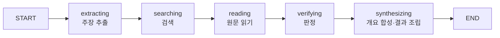
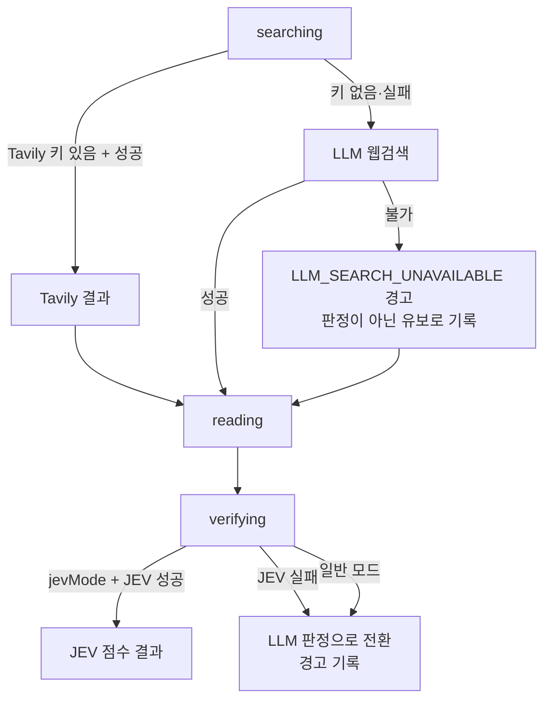
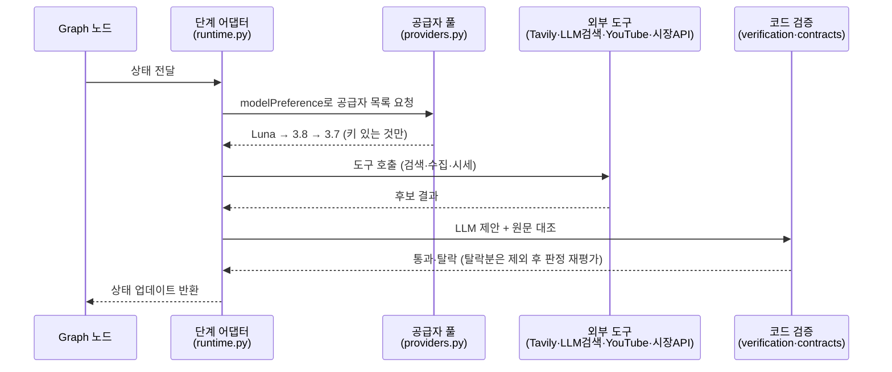

# True or Not 팩트 검증 에이전트 설계

> 최종 갱신: 2026-10-02. 아래는 현재 코드 기준(as-built)이며, 기획서 v4·PRD와 함께 본다.
> 이 문서는 평가 기준 P2-1(에이전트 아키텍처 설계서)의 5개 항목에 대응하도록 구성되어 있다.

## 선택한 연결 방식

- 공급자 우선순위: GPT-6 Luna Max → Gemini 3.8 Flash → Gemini 3.7 Flash
- OpenAI: `gpt-6-luna`; Responses API의 `reasoning.effort = max`와 `service_tier = fast`를 사용합니다. Fast 처리는 표준 대비 약 2배 요금입니다.
- Gemini: `gemini-3.8-flash`, 이후 `gemini-3.7-flash`; Interactions API의 `thinking_level = high`와 Google Search를 사용합니다.
- 인증: 서버 환경변수 `GEMINI_API_KEY`, `OPENAI_API_KEY`
- 주의: ChatGPT/Codex 구독 인증과 별도의 API 인증이며, 모델·웹 검색 사용량은 각 공급자의 API 정책에 따라 과금됩니다.

모델 선택(`modelPreference`: auto·개별 모델)은 브라우저에서 고를 수 있습니다. auto는 위 우선순위대로 시도하고, 개별 선택은 해당 모델만 단독 사용합니다(실패 시 자동 전환 없음). 각 단계에서 현재 공급자 요청이 실패하면 키가 설정된 다음 공급자를 우선순위대로 시도합니다. 성공한 모델 ID와 추론 강도는 결과에 표시합니다.

## 1. StateGraph 노드 배치 (P2-1 항목 1)

그래프 정의는 `backend/workflow.py`의 `build_workflow`가 맡으며, 실행 시 실제 동작은 `backend/runtime.py`의 `build_runtime_workflow`가 어댑터를 주입하여 완성합니다.



| 노드 | 사고 흐름 매핑 | 주입되는 동작 (`runtime.py`) | 출력 |
|---|---|---|---|
| `extracting` | 인지 (무엇을 검증할지 파악) | 텍스트·링크·이미지에서 최대 3개 주장 추출, 원문 위치 검증 | `claims`, `searchQueries`, `text` |
| `searching` | 행동 - 탐색 | Tavily 우선, 없거나 실패 시 LLM 웹검색으로 대체. 주식 질문 시 시장 맥락 첨부 | `sources` 후보, `market` |
| `reading` | 행동 - 수집 | 검색 메타데이터의 URL만 원문 수집. 접근 실패는 `unavailable`로 표시 | `sources`, `sourceTexts` |
| `verifying` | 판단 | LLM 판정 제안 → 인용·참조 무결성 코드 검증. JEV 모드 실패 시 조용히 LLM 판정으로 전환 | `claims` 확정, `evidence` |
| `synthesizing` | 검증·정리 | 검증된 원문 인용으로 AI 개요 합성 후 최종 결과 조립·계약 검증 | `answer`, `result` |

현재 그래프는 조건 분기 없는 직선형이며, 이는 의도된 단순화입니다. 품질 점검 후 되돌아가는 순환 간선(Review→Repair)은 후속 과제(R08~R09)로 분리되어 있으며, 정상 입력은 추가 실행 없이 종료됩니다.

## 2. 분기 조건과 예외 흐름 (P2-1 항목 2)

모든 분기는 명시적 조건식으로 정의되어 있으며, 예외 흐름은 사실 판정으로 위장하지 않고 실패·유보로 처리합니다.

| # | 분기 위치 | 조건 | 참일 때 | 거짓일 때 |
|---|---|---|---|---|
| F1 | 모델 선택 | `modelPreference == "auto"` | 키가 설정된 공급자를 Luna→3.8→3.7 순으로 시도 (`providers.py`) | 지정 모델만 단독 사용, 실패 시 전환 없음 |
| F2 | 검색 수단 | `TAVILY_API_KEY` 설정 + 호출 성공 | Tavily 결과 사용 | LLM 웹검색으로 대체. 둘 다 불가 시 `LLM_SEARCH_UNAVAILABLE` 경고 |
| F3 | 링크 입력 | 본문이 링크 URL 단독과 일치 | 페이지 본문 수집 후 그 본문으로 추출 (`runtime.py` `extract`) | 입력 텍스트로 추출. 주장 0건이면 링크 본문으로 1회 폴백 |
| F4 | JEV 검증 실패 | `JevError` 발생 | 파이프라인 내부에서는 로그 후 LLM 판정으로 전환. `/jev` 단독 경로는 오류 반환 | JEV 결과 사용 |
| F5 | 개요 합성 | `eligible_sources` 존재 + 합성 성공 | AI 개요 + 출처 칩 제공 | 고정 안내 문구 표시 (합성 생략·실패와 근거 부족의 문구 분리는 잔여 L4) |
| F6 | 시장 맥락 | 종목 탐지 + 토스/Finnhub 응답 성공 | 결과에 시세·차트 첨부 | 맥락 생략 후 검증 계속 (검증 실패 아님) |
| F7 | 유튜브 | `YOUTUBE_API_KEY` 설정 + 영상 존재 | 메타·댓글(최대 10개)·자막 수집. 자막은 판정 근거, 댓글은 맥락용 | 키 미설정 시 `not_configured`, 조회 실패 시 `unavailable` 표시 |



## 3. 기억·컨텍스트 윈도우·요약 전략 (P2-1 항목 3)

| 구분 | 설계 | 근거 |
|---|---|---|
| 단기 기억 | 요청 1건의 `FactCheckState`가 전부이며, 서버 영속 저장 없음. 프로세스 재시작 시 소멸 | `workflow.py` `FactCheckState`, 운영 경계(영속 큐 아님) |
| 컨텍스트 윈도우 관리 | 입력 상한으로 윈도우 초과를 사전 차단. 본문 12,000자·확인 요청 500자(UTF-16), 합성 입력은 출처별 6,000자·최대 6개 출처, 유튜브 댓글 10개·API 응답 256KB | `schemas.py`, `answer_synthesis.py` `eligible_sources` |
| 길이 초과 처리 | 링크 본문은 12,000자로 절단 후 저장하여 최종 조립 재검증 실패 방지. astral 문자 분리 방지 절단 | `runtime.py` `_truncate_units` |
| 요약 전략 | 에이전트 기억용 요약은 없음. 내용 요약(`/api/summarize`)은 사용자 요청 처리용 별도 경로이며 기억 관리로 사용하지 않음 | `summarize.py` |
| 장기 기억 | 범위 밖. 로그인·보관함·대화 기억은 후속 과제로 제외 | 기획서 v4 범위 밖 |

## 4. Tool 호출 흐름 (P2-1 항목 4)

정직한 기술 원칙: 도구 선택은 LLM의 자율적 Function Calling이 아니라, 단계 어댑터가 조건에 따라 호출하는 프로그래밍 방식입니다. LLM은 구조화 출력(JSON 스키마)으로 제안하고, 실제 호출·검증은 코드가 수행합니다.



| 호출 | 호출 주체 | LLM 역할 | 코드 역할 |
|---|---|---|---|
| 주장 추출·검색어 생성 | `extract` 어댑터 | 주장·검색어 제안 | 개수 상한(3개), 원문 위치 검증 |
| 웹검색 (Tavily·LLM) | `search` 어댑터 | LLM 검색 시 검색어 실행·결과 반환 | 공급자 선택, 출처 수 상한(6개), 동일 사이트 2개 제한 |
| 원문 수집 | `read` 어댑터 | 관여 없음 | URL 안전 검사, 리다이렉트·크기·시간 제한, 접근 상태 기록 |
| 판정 | `verify` 어댑터 | 판정·인용·관계 제안 | 인용 원문 대조, 참조 무결성, 조건 비교 후 최종 판정 |
| 개요 합성 | `synthesize` 어댑터 | 개요 초안 | 출처 ID·인용 대조, 실패 시 고정 문구 |

## 5. 상태 객체 정의 (P2-1 항목 5)

`backend/workflow.py`의 `FactCheckState`(`TypedDict`, `total=False`)가 유일한 상태 정의이며, 필드 중복 없이 단계별로 추가되는 단방향 구조입니다.

| 필드 | 타입 | 기록 시점 |
|---|---|---|
| `text`, `focus`, `consent`, `modelPreference` | `str`, `str`, `bool`, `str` | 요청 진입 |
| `linkUrl` | `str \| None` | 요청 진입 |
| `image` | `dict \| None` | 요청 진입 (JEV 경로 제외) |
| `jevMode` | `bool` | 요청 진입 |
| `claims` | `list[dict]` | extracting |
| `searchQueries` | `dict[str, str]` | extracting |
| `searchNotice` | `str` | searching (장애 시) |
| `stockSymbols` | `list[str]` | searching |
| `market` | `dict \| None` | searching |
| `sources` | `list[dict]` | searching·reading |
| `sourceTexts` | `dict[str, str]` | reading |
| `sourceSections` | `dict[str, list[dict]]` | reading |
| `evidence` | `list[dict]` | verifying |
| `result` | `dict` | synthesizing |
| `answer`, `answerModel`, `answerReasoning` | `dict`, `str \| None`, `str \| None` | synthesizing |
| `llmModel`, `llmReasoning` | `str`, `str` | 각 LLM 단계 성공 시 |

복구 루프 도입 시 추가될 필드(`diagnostics`, `recoveryCount`, `recoveryTrace`)는 현재 존재하지 않으며, 추가 시 본 표에 갱신합니다. 요청 전체 복구는 최대 1회로 제한할 예정입니다(R09).

## 구성

```text
현재 True or Not UI
  → GET /api/fact-check : 설정 유무 확인
  → POST /api/intent : 짧은 입력은 로컬·게이트 답변, 검증 대상은 파이프라인 실행
  → POST /api/fact-check : 동의한 원문·확인 요청 전송 (NDJSON 스트림)
      → 주장 추출 (최대 3개, 원문 위치 검증)
      → 검색 (Tavily 있으면 Tavily, 없으면 LLM 웹검색) + 주가 질문이면 시장 데이터(Toss 우선, Finnhub 대체)
      → 주식 질문이면 신뢰 언론사(investing.com·reuters.com·wsj.com·bloomberg.com) 우선 정렬
      → 검색 메타데이터에 존재하는 URL의 원문 수집 (링크 단독 입력은 페이지 본문으로 폴백)
      → 실제 수집 본문과 인용문 일치 확인
      → 조건·찬반 근거 비교 및 구조화 판정
      → 검증된 원문 인용으로 AI 개요 합성
  → POST /api/fact-check/jev : JEV 빠른 경로 (검색→읽기→TypeSafe 판정, 점수만 반환)
  ← 단계 이벤트 / 최종 결과 / 안전한 오류
```

진행 중 작업은 줄바꿈으로 구분한 JSON 스트림으로 전달합니다. 진행률 퍼센트는 임의로 생성하지 않습니다. 취소·새 문서·예시 불러오기·화면 이탈은 진행 중 요청을 중단하고 늦게 도착한 결과를 무시해야 합니다.

## 신뢰 경계

1. 사용자가 입력한 내용과 웹 자료는 모두 비신뢰 데이터입니다. 문서 속 지시문을 시스템 명령으로 실행하지 않습니다.
2. 모델이 텍스트에 적은 임의 URL은 출처로 승인하지 않습니다. 검색 도구가 반환한 출처 메타데이터에서 수집 대상을 가져옵니다.
3. 실제 본문에서 확인되지 않는 인용은 검증된 근거로 표시하지 않습니다.
4. 출처 접근 실패와 검색 공급자 장애를 구분합니다. 공급자 장애를 사실 판정으로 위장하지 않습니다.
5. 같은 도메인이라는 이유로 동일 원자료라고 단정하지 않습니다. 계보가 불명확하면 미확인으로 남깁니다.
6. 작성일·원자료 관계가 확인되지 않으면 빈 값이나 미확인으로 표시합니다.
7. 직접 근거를 확인할 수 없으면 긍정·부정 판정을 유보합니다.

## 데이터 계약

공유 타입은 `app/lib/fact-check-contract.ts`에 있고, 서버 검증은 `backend/contracts.py`가 맡습니다.

- 요청: 원문(UTF-16 12,000자 이하), 확인 요청(500자 이하), 전송 동의(`consent: true` 필수), 모델 선택, 링크(http/https), 이미지(jpeg/png/webp)
- 응답: 원문 범위가 연결된 주장(UTF-16 start·end), 판정, 요약, 확인·미확인 항목, 경고
- 출처: URL(리다이렉트 최종 우선), 제목, 기관 또는 호스트명, 발행일, 수집 시각, 접근 상태, 검색 출처·검색어·순위, 유튜브 메타
- 근거: 주장·출처 ID, 실제 인용문, 원문 일치 여부, 지지·반박·배경 관계
- 시장 맥락(주식 질문 한정): 심볼, 현재가·전일종가·등락률, 일봉 최대 90개, 출처(tossinvest·finnhub·krx)
- 실행 정보: 실제 지정 모델, 추론 강도, 검증 시각
- 점수 밴드: 0~19 거짓, 20~39 대체로 거짓, 40~59 중립, 60~79 대체로 사실, 80~100 검증된 사실

링크 단독 입력은 서버가 페이지 본문을 수집해 추출하며, 본문이 길면 12,000자 기준으로 재검증합니다. 출처 수집은 서버가 실제 검색으로 얻은 URL에 대해서만 수행합니다.

## 환경 설정

1. `backend/.env`에 필요한 키를 설정합니다. 키 종류는 `backend/README.md`와 `.env.example`을 따릅니다 (`OPENAI_API_KEY`, `GEMINI_API_KEY`, `YOUTUBE_API_KEY`, `TAVILY_API_KEY`, `TYPESAFE_API_KEY`, `FINNHUB_API_KEY`, `TOSS_CLIENT_ID`, `TOSS_CLIENT_SECRET`). 토스증권 키는 WTS에서 발급받고 허용 IP를 등록해야 합니다.
2. 키가 있으면 GPT-6 Luna가 1순위, 이후 Gemini 3.8 Flash와 Gemini 3.7 Flash 순으로 사용됩니다. 키가 없는 공급자는 건너뜁니다.
3. 백엔드를 재시작합니다 (`backend/*.py` 변경 시 필수. 프론트는 저장 시 자동 반영).
4. 화면에서 설정 상태를 확인합니다. 설정됨 표시는 계정의 모델 권한·잔액·호출 성공을 보장하지 않습니다.
5. 공개해도 되는 짧은 원문으로 실제 요청을 실행하고, 결과에 기록된 실제 모델과 출처 링크·원문 근거를 확인합니다.

`.env*` 파일은 Git에서 제외하고 비밀값이 없는 `.env.example`만 예외로 둡니다. `NEXT_PUBLIC_OPENAI_API_KEY`처럼 클라이언트에 노출되는 변수는 사용하지 않습니다.

## 운영 경계

- 이 단계의 API는 로컬 개발·개인 검증용입니다. 인증·사용자별 한도·악용 방지 없이 인터넷에 공개하면 안 됩니다. 공개 배포 준비물(프록시 env 게이트·공유 시크릿·Docker 2종·`render.yaml`)은 갖춰져 있으나 실행은 보류 중입니다.
- API 호출 타임아웃과 취소는 비용을 완전히 되돌리지 않습니다. 요청이 공급자에 전달된 이후 이미 사용된 토큰·검색 비용은 발생할 수 있습니다.
- GPT-6 Luna에는 `reasoning.effort = max`와 `service_tier = fast`, Gemini 모델에는 `thinking_level = high`를 사용합니다. Fast 처리는 표준 대비 약 2배 요금이며, 프로젝트에서 허용하지 않으면 400 오류가 납니다.
- `store:false`는 응답 객체 저장 설정이며, OpenAI의 모든 보존 정책이 없다는 의미가 아닙니다.
- 서버 상태 스트림은 영속 작업 큐가 아닙니다. 프로세스 재시작 시 작업 복구를 보장하지 않습니다.
- 외부 웹페이지를 가져오는 기능에는 사설망·메타데이터 주소 차단, DNS/리다이렉트 검사, 시간·크기 제한이 필요합니다.
- 백엔드에는 인증이 없습니다. loopback 밖으로 노출하지 않는 것이 전제이며, 노출 시 `BACKEND_SHARED_SECRET` 게이트를 켭니다.

## 근거 문서

- GPT-6 Luna 및 max: https://developers.openai.com/api/docs/models/gpt-6-luna
- Gemini Interactions API 및 모델 ID: https://ai.google.dev/gemini-api/docs/interactions-overview
- 웹 검색: https://developers.openai.com/api/docs/guides/tools-web-search
- 구조화 출력: https://developers.openai.com/api/docs/guides/structured-outputs

## 검증 상태

이 문서는 설계와 연결 계약을 설명합니다. 테스트·빌드·브라우저·실제 공급자 연결 결과는 별도 검증 기록에서 구분합니다. API 키가 없는 상태의 모의 테스트를 실제 모델 응답 성공으로 간주하지 않습니다.
