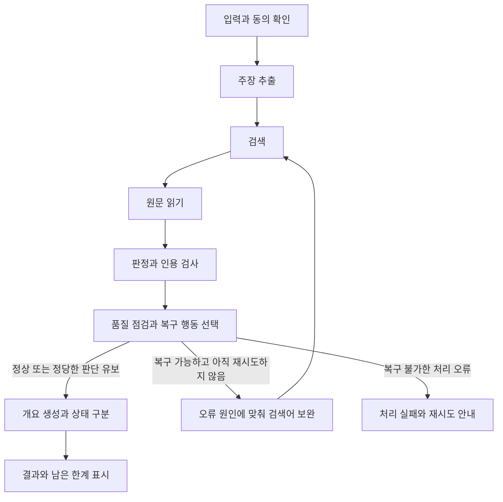

# True or Not 구현 현황 및 잔여 구현 범위

## 핵심 요약

**기본 제품은 구현되어 있으며, 이번 4명·2.5일 프로젝트는 배포·안정성 보완과 최대 1회 자가 복구에 집중합니다.**

| 구분 | 현재 구현 | 앞으로 필요한 범위 |
|---|---|---|
| 기본 제품 | 입력·주장 추출·검색·원문 읽기·판정·인용 검사·AI 개요·결과 화면·내보내기 | 입력별 전체 경로 검증, JEV 의견·예측 처리, 생성 실패와 근거 부족 구분 |
| 확장 기능 | 내용 요약, 유튜브 자막, 시장 맥락·차트, 수치 계산, 공통 인용 그룹 | 시연할 영상·종목의 실제 호출 확인, 점수 표시 정책 확정 |
| 에이전트 | LangGraph 5단계, 타입 상태, 검색·모델 대체, 인용 오류 검사 | 오류 진단→복구 전략 선택→조건부 재실행, 최대 1회 제한과 행동 기록 |
| 배포 | Dockerfile 2종, Render 설정, 공개 전환 게이트, 백엔드 공유 시크릿 | 비밀 파일 빌드 제외, 공개 접근·비용 제한, 사용자 동의, 실제 배포·스트림 검증 |
| 검증·평가 | 자동 테스트, QA 입력 20개, mini 결과 10개, 실행 스크립트 | CI·테스트 누락 보완, 동일 사례 개선 전후 비교, 4개 평가 지표 집계 |

**이번 기간의 작업 순서**

1. 배포 경계부터 해결합니다: 비밀 파일 제외, 제한 공개 방식, 외부 전송 동의, 실제 환경 연결.
2. 시연 신뢰성을 보완합니다: JEV 유형 처리, 합성 생략·실패 구분, 링크·이미지 최종 결과 검증.
3. 신규 기능은 복구 루프 하나로 제한합니다: 실패 원인에 맞춰 재탐색하고, 요청 전체에서 최대 1회만 복구합니다.
4. 고정 사례 10~15개로 전후를 비교합니다: 완료율·행동 선택 정확도·응답 일관성·평균 복구 횟수를 기록합니다.

**범위 관리:** 일정 조정 UI, 다중 에이전트, 장기 기억 DB·로그인·보관함, 신규 API, 완전한 계보 분석은 제외합니다. 일정이 부족하면 인용 재생성·JEV 빠른 경로·확장 기능 시연을 줄입니다.

**역할:** A는 화면·프록시, B는 검증·오류 기준, C는 그래프·검색·배포, D는 계약·QA·지표·발표를 담당합니다.

| 시점 | 핵심 목표 |
|---|---|
| Day 1 | 범위·정책 확정, 배포 연결과 보호 조치, 오류 진단·복구 경로 착수 |
| Day 2 | 복구 루프·회귀 검증, 전후 측정, 원격 통합, 기능 동결 |
| 마지막 날 | 배포 마무리, 검증된 시나리오 리허설, 발표 |

**확인 수준:** 구현 완료는 코드 확인 기준입니다. 기존 테스트 기록과 실제 호출·배포 성공을 구분하며, 이번 문서 작성 중 실행 검증은 하지 않았습니다.
**평가 전제:** 일정 조정이 필수 주제인지 확인해야 합니다. 장기 기억 등 제외 항목까지 평가를 완전히 충족한다고 설명하지 않습니다.

---

> 작성 기준: 2026-10-01, `main` 브랜치의 `2958b33` 코드 스냅샷
> 프로젝트 조건: AI 에이전트 과정 부트캠프, 4명, 실질 개발 기간 약 2.5일, 마지막 날 배포 및 발표
> 우선순위: 포트폴리오에 사용할 제품 완성도와 기술적 기여를 확보하고, 부트캠프 평가 요소를 최소 범위로 반영합니다.
> 문서 성격: 현재 코드의 정적 확인과 기존 검증 기록을 바탕으로 작성한 현황 문서 및 팀 적용 권장안입니다. 이 문서 작성 중 기능 수정, 유료 API 호출, 서버 실행, 배포는 수행하지 않았습니다. 잔여 범위는 구현 완료나 팀 합의 완료를 의미하지 않습니다.

## 1. 결론과 상태 기준

True or Not은 텍스트·링크·이미지에서 주장을 추출하고, 검색한 원문과 인용을 대조하여 주장별 판정과 AI 개요를 제공하는 기본 제품이 이미 구현되어 있습니다. 요약, 유튜브 자막, 시장 맥락, 수치 계산, 공통 인용 그룹도 코드에 연결되어 있습니다.

이번 팀 프로젝트의 신규 기능은 **오류를 감지하고 복구 전략을 선택한 뒤 최대 한 번 재검증하는 루프**로 제한하는 것을 권장합니다. 배포 준비물은 존재하지만, 배포 전 보호 조치와 실제 환경 검증은 별도로 필요합니다.

| 상태 | 이 문서에서의 의미 |
|---|---|
| 구현 | 해당 기능의 코드와 연결 경로를 확인했습니다. 모든 실제 입력·외부 API·배포 환경에서의 성공을 보장하지 않습니다. |
| 부분 구현 | 일부 기능은 존재하지만 정책, 범위, 사용자 표시 또는 검증이 남아 있습니다. |
| 준비 완료 | 설정·컨테이너 등 준비물이 존재합니다. 실제 배포 완료를 의미하지 않습니다. |
| 미구현 | 이번에 확인한 실행 경로에 해당 기능이 없습니다. |
| 검증 필요 | 코드 또는 기존 기록은 있으나 현재 환경에서의 실행 결과를 확인해야 합니다. |
| 제안 | 팀이 범위와 수용 기준을 확정해야 하는 향후 작업입니다. |

완료 범위는 코드 구현과 실행 검증을 구분하여 읽어야 합니다. 기획서의 오래된 본문보다 현재 코드와 최신 추가 기록을 우선했으며, 기존 문서는 수정하지 않았습니다.

## 2. 현재 구현된 범위

### 2.1 기본 제품과 검증 파이프라인

| ID | 구현된 범위 | 현재 동작과 경계 | 주요 근거 |
|---|---|---|---|
| I01 | 텍스트·링크·이미지 입력 | 본문 12,000 UTF-16 단위, 확인 요청 500 단위, http/https 링크, jpeg/png/webp 이미지 최대 1.5MB를 받습니다. JEV 빠른 경로는 이미지를 받지 않습니다. | [schemas.py](../backend/schemas.py), [dashboard](../app/components/fact-check-dashboard.tsx) |
| I02 | 채팅과 인텐트 분기 | 검증 요청과 간단한 답변을 구분하고, 이전 원문·주장·최근 사용자 메시지 일부를 전달합니다. 요약 요청은 별도 경로로 처리합니다. | [intent.py](../backend/intent.py), [main.py](../backend/main.py), [dashboard](../app/components/fact-check-dashboard.tsx) |
| I03 | 주장 추출과 유형 분류 | 최대 3개 주장을 추출하고 사실·의견·예측·불명확 유형과 검색어를 생성합니다. 인용과 UTF-16 원문 위치를 대조합니다. 현재는 후보 선택 없이 자동 실행합니다. | [extraction.py](../backend/extraction.py) |
| I04 | 링크·이미지 원문 확보 | 링크 단독 입력과 일부 링크+요청문 입력은 페이지·자막으로 대체합니다. 페이지는 12,000 UTF-16 단위로 제한합니다. 이미지에서 읽은 텍스트는 검증 대상 본문으로 사용합니다. | [runtime.py](../backend/runtime.py), [extraction.py](../backend/extraction.py) |
| I05 | LangGraph 5단계 실행 | 추출→검색→읽기→검증→합성을 순차 실행합니다. 단계별 어댑터가 연결되어 있습니다. 조건부 복귀나 품질 기반 재실행 루프는 없습니다. | [workflow.py](../backend/workflow.py), [runtime.py](../backend/runtime.py) |
| I06 | 검색과 대체 경로 | Tavily를 우선 사용하고 설정 부재·장애 시 LLM 웹검색으로 대체합니다. 주장 검색어와 링크 제목 기반 검색을 사용하며 출처는 최대 6개입니다. | [runtime.py](../backend/runtime.py), [search.py](../backend/search.py), [tavily_search.py](../backend/tavily_search.py) |
| I07 | 원문 수집과 URL 보호 | 공개 URL의 DNS·IP·리다이렉트·응답 크기·시간을 검사합니다. 원문을 읽지 못한 출처는 접근 불가로 표시하며 검색 요약을 직접 인용으로 사용하지 않습니다. | [sources.py](../backend/sources.py) |
| I08 | 주장별 판정과 인용 검사 | 7개 판정 코드, 실제 원문에 있는 인용, 주장·출처·근거 참조를 검사합니다. 비교 조건이 다르거나 인용이 확인되지 않으면 직접 근거에서 제외합니다. | [verification.py](../backend/verification.py), [contracts.py](../backend/contracts.py) |
| I09 | 주장 주변 맥락 전달 | 주장 앞뒤 문장과 링크 원문의 제목·날짜를 검증 입력에 포함합니다. 실제 원문 맥락을 보강하는 기능이며 장기 기억은 아닙니다. | [verification.py](../backend/verification.py) |
| I10 | AI 개요와 출처 연결 | 읽은 비유튜브 원문으로 개요를 생성하고 출처 ID와 인용을 검사합니다. 개요 인용은 유튜브를 제외합니다. 생성 생략·실패 표시의 의미 분리는 남아 있습니다. | [answer_synthesis.py](../backend/answer_synthesis.py), [fact-check-reply.ts](../app/components/fact-check-reply.ts) |
| I11 | 결과 화면과 원문 연결 | 주장 선택, 원문 위치, 인용·출처·지지/반박 관계, 확인·미확인 내용, 경고를 표시합니다. 모델 선택과 JEV 결과 표시도 있습니다. | [dashboard](../app/components/fact-check-dashboard.tsx), [client](../app/components/fact-check-client.ts) |
| I12 | 진행·취소·오류·재시작 | NDJSON 진행·미리보기·결과 이벤트, 브라우저 취소 전파, 늦은 응답 무시, 오류 뒤 입력 복원과 사용자 재시작이 구현되어 있습니다. 메인 프록시는 프로세스별 동시 실행 1건을 제한합니다. | [streaming.py](../backend/streaming.py), [main route](../app/api/fact-check/route.ts), [dashboard](../app/components/fact-check-dashboard.tsx) |
| I13 | 모델 선택과 Auto 대체 | Auto에서는 설정된 모델을 순서대로 시도합니다. 개별 모델 선택은 해당 모델만 사용합니다. 메인 검증 경로는 실패를 `MODEL_FAILED` 등으로 반환합니다. | [providers.py](../backend/providers.py), [runtime.py](../backend/runtime.py) |
| I14 | 데모 분리와 JSON 내보내기 | 합성 예시는 실제 검증과 구분하고 외부 요청 없이 표시합니다. 결과 JSON을 다운로드하며 유튜브 API 메타데이터·댓글은 내보내기에서 제외합니다. | [demo-state.ts](../app/components/demo-state.ts), [dashboard](../app/components/fact-check-dashboard.tsx), [youtube-context.ts](../app/lib/youtube-context.ts) |

### 2.2 이미 연결된 확장

| ID | 구현된 범위 | 현재 동작과 경계 | 주요 근거 |
|---|---|---|---|
| I15 | 내용 요약 | `/api/summarize`로 텍스트·링크·유튜브 자막을 요약합니다. 사실 판정은 하지 않으며 이미지 요약은 지원하지 않습니다. 자막 길이 기준으로 30분 이상이면 거절합니다. | [summarize.py](../backend/summarize.py), [summary route](../app/api/summarize/route.ts) |
| I16 | 유튜브 자막과 댓글 | 확보한 자막을 원문 읽기·주장 판정에 연결합니다. 댓글은 의견 맥락용이며 판정 근거가 아닙니다. 자막 수집 성공은 영상별로 달라질 수 있고 영상 자체의 내용을 분석하지 않습니다. | [youtube.py](../backend/youtube.py), [sources.py](../backend/sources.py), [runtime.py](../backend/runtime.py) |
| I17 | 시장 맥락과 차트 | 종목 탐지 시 토스증권 우선·Finnhub 대체로 시세와 일봉을 조회하고 차트를 표시합니다. 수집 실패 시 맥락을 생략하고 검증을 계속합니다. 매매 권고 기능은 아닙니다. | [stocks.py](../backend/stocks.py), [runtime.py](../backend/runtime.py), [stock-chart.tsx](../app/components/stock-chart.tsx) |
| I18 | 수치 계산 보조 | 인접 숫자 사이 증감률을 코드로 계산해 검증 입력에 제공합니다. 문장 속 숫자의 의미를 완전히 해석하는 기능이나 범용 단위 변환기는 아닙니다. | [compute.py](../backend/compute.py), [verification.py](../backend/verification.py) |
| I19 | URL 중복·공통 인용 그룹 | URL 중복을 제거하고, 일정 길이의 공통 원문을 공유하는 출처를 같은 그룹으로 묶습니다. 공통 문구 기반 추정이며 완전한 원자료 계보·출처 독립성 분석은 아닙니다. | [search.py](../backend/search.py), [runtime.py](../backend/runtime.py) |
| I20 | JEV 빠른 판정과 보완 | 검색→읽기→JEV 점수 결과 경로가 있습니다. 입력 공백 보존, 빠른 경로의 LOW_CONFIDENCE 유보 처리, 점수·판정 정합 경고가 구현되어 있습니다. 빠른 경로의 유형 분류 문제는 남아 있습니다. | [runtime.py](../backend/runtime.py), [verification.py](../backend/verification.py) |

### 2.3 보호 조치와 배포 준비

| 범위 | 현재 상태 | 남아 있는 경계 |
|---|---|---|
| 검증·요약 요청의 동의 필드 | `consent=true`를 검사합니다. | 현재 화면은 값을 자동으로 채워 전송합니다. 사용자 확인 절차 완료로 간주하지 않습니다. `/api/intent`에는 동의 필드가 없습니다. |
| 서버 전용 키·안전한 오류 | 서버 환경변수·설정 객체를 사용하고, 주요 검증 오류는 정리된 메시지로 반환합니다. | Docker 빌드 컨텍스트의 비밀 파일 제외와 공개 메시지 점검이 필요합니다. |
| 로컬·공개 실행 전환 | 공개 요청과 원격 HTTPS 백엔드를 허용하는 환경변수 게이트가 구현되어 있습니다. | 기본값은 로컬 정책입니다. 공개 전환만으로 사용자 접근·비용 제한이 생기지는 않습니다. |
| 백엔드 공유 시크릿 | 시크릿이 설정되면 `/health`를 제외한 경로의 헤더를 검사합니다. | 프록시와 백엔드 간 보호입니다. 공개 프론트엔드의 이용자 인증·호출 한도를 대신하지 않습니다. |
| Docker·Render 설정 | 프론트·백엔드 Dockerfile과 `render.yaml`이 있습니다. | 실제 컨테이너 빌드·배포·원격 스트림 성공은 이번 문서에서 확인하지 않았습니다. |
| 테스트·QA 기반 | 백엔드·프론트 테스트, 20개 QA 입력, 실행 스크립트, 10개 mini 결과 기록이 있습니다. | CI와 평가 지표 집계, 신규 루프 전후 비교, 최신 배포 회귀가 필요합니다. |

근거: [schemas.py](../backend/schemas.py), [main.py](../backend/main.py), [main route](../app/api/fact-check/route.ts), [Dockerfile](../Dockerfile), [backend Dockerfile](../backend/Dockerfile), [render.yaml](../render.yaml), [QA 실행 스크립트](../scripts/qa_baseline.py).

## 3. 아직 구현·보완해야 하는 범위

아래 R 번호는 이 문서의 잔여 작업 번호입니다. 기존 기획서의 L 번호·PRD의 FR 번호를 변경하지 않습니다. 우선순위는 팀 적용 제안이며, 실제 배포와 시연 대상 기능에 따라 확정해야 합니다.

### 3.1 배포·시연 전 필수 확인과 보완

| ID | 현재 확인한 공백 | 필요한 작업 | 완료 기준 |
|---|---|---|---|
| R01 | 루트 `.dockerignore`에 비밀 파일 제외 규칙이 없고 백엔드 컨텍스트에는 해당 파일이 없습니다. Dockerfile은 소스를 통째로 복사합니다. | 각 빌드 컨텍스트에서 `.env*` 등 비밀 파일과 불필요한 로컬 파일을 제외합니다. 비밀값 없는 예제 파일은 필요할 때만 허용합니다. | 빌드 컨텍스트와 최종 이미지에 비밀 파일·키가 포함되지 않음을 확인합니다. 현재 상태로 배포 빌드를 진행하지 않습니다. |
| R02 | 공개 모드는 로컬 요청 제한을 해제하지만 공개 프론트엔드의 접근·비용 제한은 없습니다. 동시 실행 제한은 메인 프록시에만 있습니다. | 부트캠프용 제한 공개 방식을 정하고 검증·JEV·인텐트·요약 요청에 적용합니다. 2.5일 범위에서는 간단한 서버 접근 게이트와 호출 한도를 우선 검토합니다. | 승인되지 않은 요청이 유료 호출 전에 차단되고, 허용 요청과 초과 요청을 구분합니다. 백엔드 공유 시크릿도 실제 배포에서 확인합니다. |
| R03 | 화면의 동의 값은 자동 입력되고 인텐트 API에는 동의 계약이 없습니다. | 사용자 확인과 실제 외부 전송을 연결하고, 인텐트도 같은 동의 경계를 사용하도록 보완합니다. | 동의 전에는 입력·이전 원문이 외부 LLM·검색으로 전송되지 않습니다. |
| R04 | `/api/fact-check/jev` 빠른 경로가 입력 전체를 `kind="fact"`인 주장 1개로 만듭니다. | 기존 추출·유형 분류를 재사용합니다. 일정상 해결되지 않으면 빠른 경로를 이번 시연·공개 범위에서 제외합니다. | 의견·예측을 확정된 사실로 점수 판정하지 않습니다. 메인 그래프의 JEV 옵션과 빠른 API를 별도로 검사합니다. |
| R05 | 합성 대상 없음·생략·실패가 `insufficient_answer()`로 합쳐집니다. | 근거 부족, 생성 생략, 생성 실패의 의미를 계약·화면에서 구분합니다. | 동일 주장 판정을 유지하면서 개요 생성 실패는 처리 실패로 표시합니다. 기술 장애를 근거 부족으로 설명하지 않습니다. |
| R06 | 링크 길이 제한과 이미지 관찰 텍스트 대체는 이미 구현되어 있지만 최신 전체 경로의 실행 확인이 필요합니다. | 링크 단독·링크+요청문·이미지 단독·긴 원문을 최종 결과 조립과 화면까지 검증합니다. 실패한 경계만 수정합니다. | 입력과 원문 위치가 일치하고, 조립 성공 또는 명확한 안전 실패가 확인됩니다. 기존 L3 전체를 미수정 상태로 되돌려 설명하지 않습니다. |
| R07 | 컨테이너·호스팅 설정은 있으나 배포 성공을 확인하지 않았습니다. | 환경 설정, 컨테이너 빌드, 원격 API·스트림, 취소·재요청을 연결 검증합니다. | 제한 공개 URL에서 실제 정상 검증·판단 유보·처리 실패 시연이 가능하고, 설정만 존재하는 상태와 구분합니다. |

근거: [.dockerignore](../.dockerignore), [Dockerfile](../Dockerfile), [backend Dockerfile](../backend/Dockerfile), [main.py](../backend/main.py), [runtime.py](../backend/runtime.py), [dashboard](../app/components/fact-check-dashboard.tsx), [attachment tests](../backend/tests/test_attachments.py).

### 3.2 이번 프로젝트에서 추가할 최소 에이전트 범위

| ID | 현재 상태 | 제안하는 구현 | 완료 기준 |
|---|---|---|---|
| R08 | 인용 거절·자료 접근 실패는 처리하지만 후속 복구 행동을 고르는 그래프 분기는 없습니다. | 품질 점검과 복구 전략 선택을 추가합니다. 첫 구현은 검색어·출처를 바꾸는 재탐색 1종을 우선하고, 인용 재생성은 여유가 있을 때 추가합니다. | 정상 입력은 추가 실행 없이 종료하고, 정의된 복구 사례에서 조건부 복귀가 실제 발생합니다. 일반 근거 부족·의견·예측을 자동 오류로 취급하지 않습니다. |
| R09 | 요청 전체의 품질 복구 횟수·오류 원인·선택 행동을 기록하는 상태가 없습니다. | 기존 상태에 구조화된 진단, 복구 횟수, 행동과 결과 기록을 추가합니다. 요청 전체에서 복구는 최대 1회로 제한합니다. | 무한 반복이 없고 취소·전체 제한 시간·기존 모델 선택 정책이 유지됩니다. 재탐색 뒤 출처·인용 참조가 이전 시도와 섞이지 않습니다. |
| R10 | QA 입력과 실행기는 있지만 복구 루프의 전후 비교·4개 평가 지표는 없습니다. | 기존 사례 중 10~15개를 고정해 기준 실행과 개선 실행을 비교합니다. 오류 주입 사례와 실제 API 사례를 구분합니다. | 완료율·도구/복구 행동 선택 정확도·응답 일관성·평균 복구 횟수를 동일 기준으로 집계합니다. 원본 기록과 코드 기준을 남깁니다. |
| R11 | 테스트 파일은 있으나 CI 설정은 확인되지 않았습니다. `npm test`는 요약 route 테스트를 포함하지 않습니다. | 기존 테스트를 CI에서 실행하고 테스트 명령의 실제 포함 범위를 정리합니다. 신규 복구·배포 경계에 필요한 실패 사례를 추가합니다. | 백엔드·프론트 테스트, 타입 검사, 빌드가 실행되고 요약 경로 테스트도 누락되지 않습니다. |

신규 제품 기능은 R08~R09에 집중합니다. R10~R11은 해당 기여를 설명하고 회귀를 방지하기 위한 평가·검증 작업입니다. 모든 외부 도구를 자유롭게 호출하는 범용 에이전트나 별도 에이전트 플랫폼으로 확장하지 않습니다.

### 3.3 결정 또는 후속 보완

| ID | 남은 항목 | 현재 근거 | 권장 처리 |
|---|---|---|---|
| R12 | 주장별 점수와 종합 평균 표시 정책 | 기획서의 잠정 정책은 평균 미표시지만 화면과 채팅 응답은 평균 점수를 표시합니다. | 킥오프에서 정책을 확정하고 화면·소개 문구·테스트를 맞춥니다. 점수를 측정된 정확도로 설명하지 않습니다. |
| R13 | 실제 사용 모델·판정 경로 표시 | 결과 조립은 메타데이터가 없으면 기본 모델·추론 값을 채웁니다. JEV 두 경로의 실패 처리도 다릅니다. | 미확인 모델을 실제 사용 모델로 표시하지 않도록 계약을 검토하고, 판정 경로·대체 여부를 명시합니다. |
| R14 | 인텐트·요약 본문 제한 방식 | 두 프록시는 `req.text()`로 전체를 읽은 뒤 크기를 검사합니다. | 메인 프록시의 제한 읽기를 재사용해 읽는 중 상한을 적용합니다. |
| R15 | 자막·시장 데이터 외부 환경 검증 | 연결 코드는 있으나 영상·종목·권한·호스팅 환경별 성공은 별도입니다. | 발표에 쓸 영상·종목만 실제 확인하고 실패 시 기본 검증이 유지되는지 점검합니다. 실패한 확장은 시연에서 제외합니다. |
| R16 | 문서 간 현황 불일치 | 기존 요약본·PRD·UI 검증 문서에 Finnhub 미연결, 로컬 전용, 옛 UI 단계 등의 설명이 남아 있습니다. | 팀 합의 후 문서별 적용 시점을 표시하고 현재 상태를 통일합니다. 이번 문서는 기존 문서를 자동으로 대체하지 않습니다. |

근거: [dashboard](../app/components/fact-check-dashboard.tsx), [fact-check-reply.ts](../app/components/fact-check-reply.ts), [runtime.py](../backend/runtime.py), [intent route](../app/api/intent/route.ts), [summary route](../app/api/summarize/route.ts), [package.json](../package.json).

## 4. 최소 복구 루프의 설계 제안

### 4.1 실행 흐름

이는 제안 그래프입니다. 현재 그래프는 Review·Repair와 복귀 간선이 없는 순차 구조입니다. 예외로 발생하는 검색·수집 장애도 복구 판단에 전달되어야 하며, 판정 후 결과만 검사하는 것으로 모든 오류 복구가 완료되었다고 설명하지 않습니다.

### 4.2 복구 기준

| 상황 | 행동 | 재실행 기준 |
|---|---|---|
| 후보 원문을 모두 읽지 못했고 대체 탐색이 가능함 | 오류 원인과 기존 검색어를 바탕으로 새 검색어·대체 출처를 선택합니다. | 검색→읽기→검증을 최대 1회 다시 실행합니다. |
| 인용이 원문에 없거나 참조가 잘못됨 | 인용을 제외하고 결과를 유보합니다. 인용 재생성은 선택 범위입니다. | 추가 구현 시 기존 원문과 실패 정보를 사용하며 동일한 전체 복구 한도를 공유합니다. |
| 정상적으로 탐색했지만 직접 근거가 부족함 | 근거 부족과 검색 범위를 표시합니다. | 자동 재실행을 강제하지 않습니다. |
| 의견·현재 확정할 수 없는 예측 | 검증 대상 아님 또는 유형에 맞는 결과를 표시합니다. | 참·거짓 결론을 얻기 위한 재실행을 하지 않습니다. |
| 잘못된 입력·동의 없음·접근 권한 없음·취소 | 오류 또는 취소로 종료합니다. | 유료 재실행을 하지 않습니다. |

품질 실패는 기존 검증 규칙으로 감지하고, 복구 선택에 LLM을 사용한다면 허용된 행동과 검색어만 구조화 출력으로 받습니다. 실제 호출은 프로그램이 검증한 뒤 실행합니다. 원시 사고 과정 대신 오류 코드, 선택 행동, 실행 결과를 기록합니다.

### 4.3 상태와 안전한 종료

| 상태 항목 | 목적 |
|---|---|
| 기존 `claims`, `searchQueries`, `sources`, `sourceTexts`, `evidence` | 현재 입력·주장·검색·근거 구조를 재사용합니다. |
| `diagnostics` 제안 필드 | 단계·오류 코드·대상 ID·복구 가능 여부를 구조화합니다. |
| `recoveryCount` 제안 필드 | 요청 전체의 품질 복구를 0~1회로 제한합니다. 공급자 대체 횟수와 구분합니다. |
| `recoveryTrace` 제안 필드 | 선택한 행동·사용 도구·성공/실패·소요 시간을 남깁니다. |

복구 때 입력과 추출 주장 스냅샷을 보존하고, 새로 수집한 근거의 참조 무결성을 다시 검사해야 합니다. 전체 제한 시간은 재시도 때 초기화하지 않습니다. Auto만 기존 모델 대체 정책을 사용하며, 개별 모델 선택은 복구 과정에서도 유지합니다.

## 5. 부트캠프 평가와의 연결

평가 이미지의 기술 요구를 True or Not에 적용한 제안입니다. 이미지의 ‘복합 API 연계 일정 조정 에이전트’가 필수 도메인이라면 이 방안이 주제 요건을 충족한다고 단정할 수 없습니다. 도메인 변경 허용 여부는 구현 착수 전 확인해야 합니다.

| 평가 항목 | 현재 대응 | 이번 최소 대응 및 한계 |
|---|---|---|
| P2-1: StateGraph 노드와 흐름 | 5단계 노드가 구현되어 있습니다. | 품질 점검·복구 분기를 추가하고 현재/개선 그래프를 구분합니다. |
| P2-1: 분기 조건·Fallback | 검색·모델·시장 데이터 대체가 있습니다. | 오류 유형별 조건, 복구 횟수, 종료 기준을 명시합니다. |
| P2-1: 기억·컨텍스트·요약 | 단기 상태, 최근 대화 일부, 입력 길이 제한이 있습니다. | 장기 기억·대화 기억 요약은 범위에서 제외합니다. 내용 요약 기능을 에이전트 기억 관리로 설명하지 않습니다. 해당 평가의 완전 충족을 주장하지 않습니다. |
| P2-1: Function Calling·Tool Use | 공급자 웹검색 도구와 Python API 어댑터가 있습니다. | 실제 호출 방식대로 시퀀스를 작성합니다. Python 함수 호출을 LLM의 자율적 Function Calling으로 바꾸어 설명하지 않습니다. |
| P2-1: 타입 상태와 중복 관리 | `FactCheckState`·요청/결과 계약이 있습니다. | 기존 필드를 재사용하고 복구에 필요한 진단·횟수·기록만 추가합니다. 예시의 `messages` 등을 형식적으로 복제하지 않습니다. |
| P2-2: 오류 감지 기준 | 원문 인용·참조·조건 검사가 있습니다. | 읽기 실패와 인용 실패를 재현하는 사례 및 기계 판독 가능한 진단을 추가합니다. |
| P2-2: 수정 이력과 전후 비교 | QA mini 기록은 있습니다. | 변경 전후 코드 기준, 같은 입력, 모델·설정, 결과와 한계를 표로 기록합니다. |
| P2-2: 감지→분석→수정→재실행→검증 | 현재는 검증·유보와 공급자 대체 중심입니다. | R08~R09의 실제 복구 흐름과 종료 사례를 활동도로 제출합니다. |
| P2-2: 수치 지표 | 완전한 집계는 없습니다. | 아래 정의로 집계하고 실제 측정값만 보고합니다. |

### 평가 지표의 최소 정의

| 지표 | 정의 | 주의점 |
|---|---|---|
| 태스크 완료율 | 사전 정의한 기대 행동·결과를 충족한 사례 수 / 전체 사례 수 | 의견 제외·정당한 판단 유보도 기대값에 맞으면 성공입니다. 처리 실패는 별도입니다. |
| 도구·복구 행동 선택 정확도 | 사전 정의한 허용 행동과 일치한 선택 수 / 평가 가능한 선택 수 | 고정된 도구 순서를 자율 선택의 정확도로 보고하지 않습니다. 평가 불가 사례는 별도 표시합니다. |
| 응답 일관성 | 동일 조건으로 반복한 사례 중 판정·처리 상태가 일치한 비율 | 문구 일치가 아니라 의미와 상태 기준입니다. 반복 측정 전에는 미측정입니다. |
| 평균 재실행 횟수 | 요청 내부 품질 복구 횟수의 합 / 전체 요청 수 | 공급자 Fallback, 사용자 재요청, 실행 스크립트의 HTTP 재시도와 분리합니다. |

기존 `qa_baseline.py`는 HTTP 실패 시 요청 자체를 다시 보내는 기능이 있습니다. 이것은 에이전트 내부의 자가 수정이 아닙니다. 전후 비교에서는 외부 재요청과 내부 복구를 따로 기록하도록 실행기를 보완해야 합니다.

## 6. 4명·2.5일 적용 권장안

### 역할

| 역할 | 주된 작업 | 협업 경계 |
|---|---|---|
| A: 프론트·프록시 | 동의·공개 접근·상태 표시, 프론트 배포, 필요 시 복구 진행 안내 | 계약 변경은 D와 확인합니다. 큰 UI 개편은 하지 않습니다. |
| B: 검증 엔진 | 오류 진단 기준, JEV 유형 처리, 합성 상태 구분, 복구 전략의 품질 | C의 그래프 연결을 함께 검토합니다. |
| C: 그래프·검색·배포 | `workflow.py`·`runtime.py` 연결, 기존 도구 재사용, 백엔드 배포와 Docker 보호 | 그래프 조립은 한 명이 맡아 충돌을 줄입니다. |
| D: 계약·QA·문서 | 계약 조정, 고정 사례·지표·CI, 개선 전후 보고서와 발표 | 기존 작업과 이번 팀 기여를 구분하고 유료 측정을 통제합니다. |

### 일정과 축소 기준

| 시점 | 작업 | 종료 기준 |
|---|---|---|
| Day 1 오전 | 주제 허용·시연 범위·점수 정책 확정, Docker 보호와 제한 공개 방식 결정, 배포 연결 시도 | 실제 환경의 막힌 부분을 파악하고 고정 QA 입력과 기준 코드를 확보합니다. |
| Day 1 오후 | 배포·동의·시연 차단 문제 해결, 오류 진단과 단일 재탐색 경로 구현 | 정상 종료와 복구 분기의 테스트가 준비됩니다. |
| Day 2 | 복구 한도·취소·참조 무결성 회귀, 동일 사례 전후 측정, 원격 통합과 발표자료 | 배포 환경에서 정상·판단 유보·처리 실패가 구분됩니다. 신규 기능을 동결합니다. |
| 마지막 날 | 배포 마무리, 시연 리허설, 발표 | 새 기능을 추가하지 않고 검증된 시나리오와 기여·한계를 제시합니다. |

배포·데이터 경계가 해결되지 않으면 새 복구 기능보다 해당 문제를 먼저 닫습니다. 범위가 넘치면 인용 재생성, JEV 빠른 경로, 이미지·시장·유튜브 확장 시연 순으로 축소할 수 있습니다. 실제로 확인하지 않은 복구·배포 기능은 완료로 보고하지 않습니다.

## 7. 이번 기간에 추가하지 않을 범위

| 범위 | 제외 또는 보류 이유 |
|---|---|
| 일정 조정·캘린더 기능 | 제품 핵심과 직접 연결되지 않습니다. 필수 주제로 확정되면 별도의 범위 재협의가 필요합니다. |
| 다중 에이전트 협업 구조 | 단일 검증 흐름의 복구만으로 이번 개선 목표를 설명할 수 있습니다. |
| 장기 기억 DB·로그인·보관함 | 배포·검증·복구보다 구현과 관리 범위가 커집니다. 제한 공개 접근 게이트와는 구분합니다. |
| 신규 API 확대·KOSIS/KRX 신규 연결 | 기존 검색·원문·시장 경로를 우선 사용합니다. 승인·권한 대기를 필수 일정에 넣지 않습니다. |
| 완전한 원자료 계보·출처 독립성 분석 | 현재 공통 문구 그룹의 한계를 명시하고 후속 과제로 둡니다. |
| 후보 선택·편집·재검증 UI, 결과 공유·알림 | 이번 최소 복구 흐름의 필수 요소가 아닙니다. |
| 자유로운 도구 실행·무제한 재시도·전문 의사결정 권고 | 제품의 근거 검증 목적과 운영 한도를 벗어납니다. |

## 8. 검증 기록과 문서 사용법

### 현재 확보한 기록

| 항목 | 확보한 근거 | 현재 문서의 판단 |
|---|---|---|
| 백엔드·프론트 테스트, 타입 검사 | 기획서 §20에 2026-10-01 기준 `324 passed`, `59 passed`, `tsc` 통과가 기록되어 있습니다. | 기존 기록입니다. 이 문서 작성 중 재실행하지 않았습니다. 새 변경의 통과 근거로 재사용하지 않습니다. |
| 실제 사례 mini | `QA-베이스라인.md`에 E01~E10 각 1회 기록이 있습니다. 예상과 다른 결과 및 추출 제외가 보고되어 있습니다. | 소규모 관측입니다. 서비스 전체 정확도나 반복 일관성으로 해석하지 않습니다. |
| QA 입력·실행기 | `qa_cases.json`에 20개 입력, `qa_baseline.py`에 반복 실행·결과 저장 코드가 있습니다. | 준비 기반입니다. 전체 사례 실행 완료나 평가 지표 집계 완료와 구분합니다. |
| 브라우저·실제 공급자 | 기존 기획서·인계서에 과거 검증 기록이 있습니다. | 현재 배포 환경의 성공을 증명하지 않습니다. 신규 흐름은 다시 확인해야 합니다. |
| Docker·공개 배포 | Dockerfile·Blueprint·프록시 게이트·공유 시크릿 코드를 확인했습니다. | 준비 완료입니다. 실제 배포 상태는 조회하지 않았습니다. |

### 최종 완료 확인

- 배포·시연 대상 기능에 필요한 R01~R07을 해결하거나 대상에서 명시적으로 제외합니다.
- R08~R09는 실제 조건부 복구와 최대 1회 종료를 확인합니다.
- R10의 전후 지표와 R11의 회귀 결과를 기록합니다. 미측정·실패도 함께 남깁니다.
- 실제 API 사례와 오류 주입·fixture 사례, 제품 내부 복구와 외부 재요청을 구분합니다.
- 사용한 임시 서버·테스트 브라우저를 정리하고, 포트가 닫혔는지 확인합니다. 기존 사용자 서버를 중단했다면 복구합니다.
- 포트폴리오에는 기존 제품 범위, 이번 4인 팀 개선 범위, 개인별 기여, 코드 기준과 측정 결과를 구분합니다.

### 기준 문서

- [기획서 v4 및 2026-10-01 추가 기록](True_or_Not_기획서-v4.md)
- [기존 팀 PRD](PRD.md)
- [기존 잔여작업 단계표](단계별-잔여작업.md)
- [현재 에이전트 설계 문서](<True or Not-agent-architecture.md>)
- [QA mini 베이스라인](QA-베이스라인.md)
- [QA 예문](QA-예문-10선.md)
- [QA 입력 20개](../scripts/qa_cases.json)
- [QA 실행 스크립트](../scripts/qa_baseline.py)
- 사용자가 제공한 부트캠프 교과목 2 평가 이미지: P2-1 에이전트 아키텍처 설계서, P2-2 에이전트 시험 결과 보고서

이 문서는 현황과 다음 범위의 대조표입니다. 팀이 잔여 범위를 확정한 뒤 기존 PRD·단계표·설계서를 갱신하며, 구현 이후에는 완료 기준과 실제 검증 근거를 추가해야 합니다.
