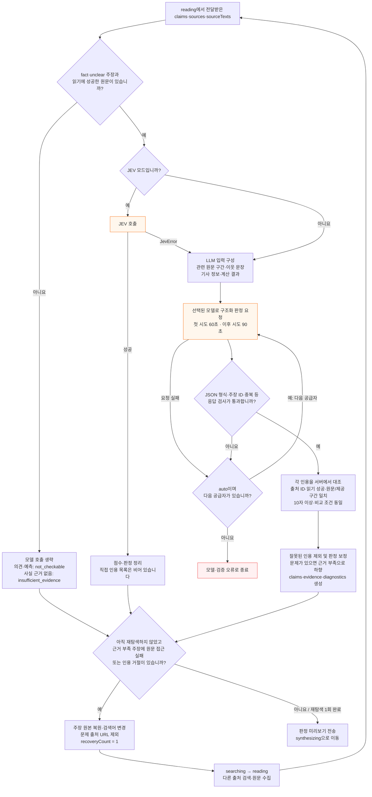
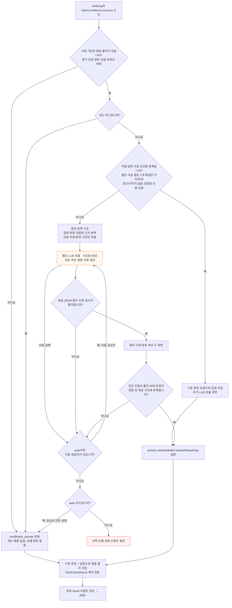

# 2026-10-08 판정·답변 작성 노드 상세 흐름

## 확인 범위

사용자가 요청한 `verifying`와 `synthesizing` 내부 흐름을 현재 작업 트리의 실제 함수와 대조했습니다. 실행 순서는 판정 → 답변 작성입니다. 기준 HEAD는 `2f21bb0`이며 다른 작업의 미커밋 변경이 있는 환경에서 읽기 전용으로 앱 코드를 확인했습니다. 기존 지식 그래프에는 리팩터링 전 위치가 남아 있어 현재 소스 위치를 우선했습니다.

### verifying — 판정

### synthesizing — 답변 작성

## 공통 규칙과 예외

- 자동 선택은 키가 설정된 공급자만 DeepSeek → Luna → Gemini 3.8 → Gemini 3.7 순서로 시도합니다. 모델을 명시하면 해당 모델만 사용합니다.
- 공급자 대체와 검색 재탐색은 별개입니다. 공급자 대체는 단계 안에서 순차 실행하며, 검색 → 읽기 → 판정 복귀는 요청당 최대 1회입니다.
- `stream_events`는 전체 요청을 240초로 제한합니다. 시간 초과는 현재 단계에서 중단하고 `TIMEOUT` 이벤트를 전송합니다. 노드별 시간은 전체 제한 안에서 누적됩니다.
- 합성의 `NOT_CONFIGURED`·`SYNTHESIS_FAILED`와 사전 출처 부족은 고정 근거 부족 답변으로 처리됩니다. 명시한 모델의 `MODEL_FAILED`·`MODEL_UNAVAILABLE` 및 다른 예외는 오류로 전파됩니다.
- 최종 결과 계약 검사 실패는 `AGENT_FAILED`로 종료됩니다. TIMEOUT 뒤에 자동 재요청하지 않습니다.
- 직접 조립 조건은 `direct_fact_answer` 전체 검사를 따릅니다. 경고·복구 요청·부적합한 인용 등이 있으면 모델 합성으로 진행합니다.

## 소스 대조 및 실행 기록

| 항목 | 상태 | 근거 |
|---|---|---|
| 기존 그래프 조회 | passed | Python으로 graph.json 어휘 확인 및 BFS 깊이 2 조회: 414개 연결 노드. 검색어 synthesize, verify, provider, fallback, recovery |
| 실제 내부 처리와 분기 대조 | passed | backend/runtime.py, runtime_adapters.py, verification.py, answer_synthesis.py, recovery.py, workflow.py, streaming.py, providers.py |
| 기존 관측 기록 대조 | passed | 2026-10-08-youtube-재현.md의 판정 → preview → 합성 → 전체 240초 TIMEOUT 순서 |
| 코드 실행·단위/E2E 테스트 | not_run | 분석·문서 작성 요청이며 앱 코드를 변경하지 않았습니다 |
| 실제 공급자·성능 재측정 | not_run | 새 외부 요청을 실행하지 않았습니다 |
| Mermaid 렌더 화면 검증 | not_run | 노드·간선은 소스와 정적으로 대조했으며 렌더 실행기는 확인되지 않았습니다 |

명령: PowerShell Get-Content와 rg로 관련 함수·지침·상태를 확인하고, Python으로 기존 graph.json 어휘/연결을 조회했습니다. 초기 샌드박스 실행기는 setup refresh 오류로 실패하여 읽기 전용 확인과 프로젝트 문서 갱신을 승인된 실행 경로로 수행했습니다. 비밀 값·고객 데이터는 기록하지 않았습니다. git diff --check로 문서 공백 오류를 검사합니다.

남은 범위: 현재 코드 기준의 실제 지연·완료율 및 공급자별 실패 원인은 별도 실측이 필요합니다. 이 흐름도는 사용자 표의 각 시간/비율의 의미나 특정 측정에서 수행된 재시도 횟수를 추정하지 않습니다.
