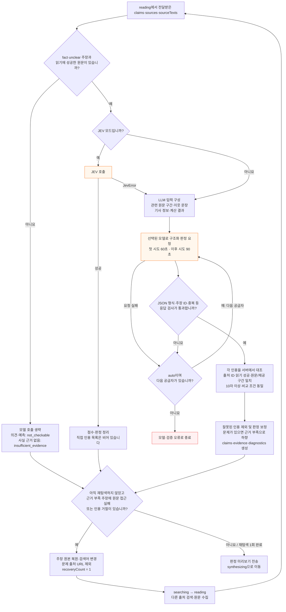
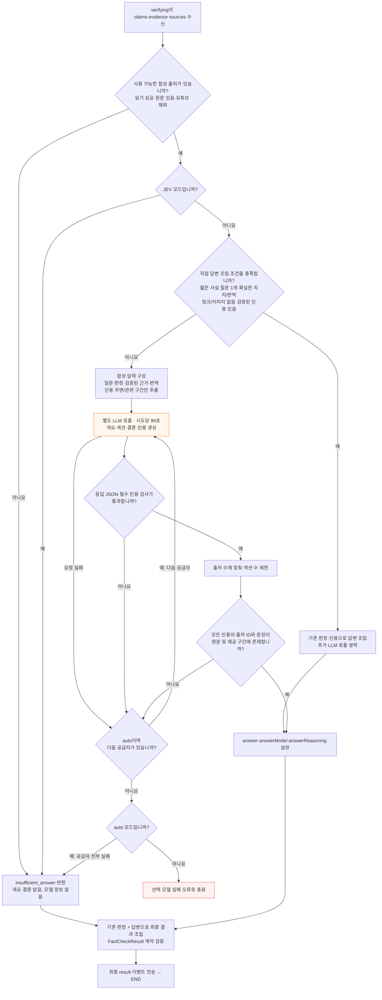

# Search 작업현황

기준일: 2026-10-08. 역할: `feat/search` 분기의 완료·남은 작업을 기록합니다. 제품 정책과 전체 T/D 목록은 [작업현황](작업현황.md)을 따릅니다.

## 완료

| 일자 | 작업 | 결과물 | 확인 상태 |
|---|---|---|---|
| 2026-10-08 | Agent State·Node 설계 초안 작성 | `docs/agent-state-node.md` 신규 생성. State 8개 필드와 5개 Node(입력 분석→출처 검색→원문 수집→주장 검증→최종 응답) 정의 | 파일 읽기 확인 완료. `backend/workflow.py`의 5단계 흐름과 대조하였으며, 실공급자·원격 검증은 미실시 |
| 2026-10-08 | YouTube 검증 5회 반복 재현 | 동일 입력 5회 전송. 성공 4회(9~226초)·TIMEOUT 1회, 재탐색 3회 동작·동작 시 모두 성공. [기록](qa/실행기록/2026-10-08-youtube-5회.md) | 스트림 이벤트·소요·최종 상태 확인 완료. 단계별 소요·내부 예외 내용은 미검증 |
| 2026-10-08 | 연근 Shorts 기존 실행 기록 보정 | [영상](https://youtube.com/shorts/1jMps1WcXVo?si=9DsZIRFpowGuY9ZV) 테스트 기록 | 기존 1회 기록은 60초 설정으로 표기했으나, 당시 요청을 받은 8010 서버가 60초 변경 커밋 이전 리비전으로 구동된 사실을 확인했습니다. 기존 240초 `TIMEOUT`은 60초 비교 데이터에서 제외합니다 |
| 2026-10-08 | 연근 Shorts 60초·90초 비교 각 3회 | 같은 질문·focus·영상 URL, `auto` 모델로 60초·90초 서버를 분리해 교대로 실행 | 60초: 3/3 `TIMEOUT`(각 240초); 2회 합성 진입. 90초: 1/3 완료(145.6초), 1회 합성 중 `TIMEOUT`(240.1초), 1회 판정 중 `AGENT_FAILED`(224.6초). 완료 결과는 `partially_supported`, 주장 1건·출처 2개·근거 6개. 성공한 90초 실행의 첫 판정은 39.9초로 60초 제한 안에 있어, 소표본 결과만으로 90초가 성공 원인이라고 단정할 수 없습니다. 전체 스트림 제한은 두 조건 모두 240초 |
| 2026-10-08 | 판정 구조화 출력 임시 A/B (DeepSeek V4.1 Flash) | 동일한 합성 주장·근거로 현재 JSON 모드와 JSON 모드 해제(스키마 지시는 동일)를 각 2회 실행. 판정 함수만 호출했고 검색·읽기는 생략했습니다 | JSON 모드: 12.19초·18.57초(평균 15.38초), 2/2 형식·근거 검증 통과; 근거 부족(20점·근거 1개), 대체로 뒷받침(82점·근거 2개). JSON 모드 해제: 14.69초·15.77초(평균 15.23초), 2/2 통과; 일부 뒷받침(68점·근거 1개), 대체로 뒷받침(80점·근거 1개). 평균 차이 0.15초는 의미 있는 속도 차이로 보기 어렵고, 합성 입력·조건별 2회라 정확도 비교는 아닙니다 |
| 2026-10-08 | 판정·답변 작성 노드 상세 흐름 작성 | 이 문서의 판정·답변 작성 상세 흐름도 2개와 모델 대체·재탐색·시간 제한 정리 | 실제 코드 대조 및 문서 공백 검사 완료. 실공급자·성능 재측정과 Mermaid 렌더 화면 검증은 미실시 |

## 판정·답변 작성 노드 상세 흐름

실제 실행 순서는 `verifying`(판정) → `synthesizing`(답변 작성)입니다. 아래 흐름은 `runtime.py`, `runtime_adapters.py`, `verification.py`, `answer_synthesis.py`, `recovery.py`, `workflow.py`, `streaming.py`, `providers.py`의 내부 처리와 대조했습니다.

### verifying — 판정

### synthesizing — 답변 작성

### 공통 규칙과 예외

- 자동 선택은 키가 설정된 공급자만 DeepSeek → Luna → Gemini 3.8 → Gemini 3.7 순서로 시도합니다. 모델을 명시하면 해당 모델만 사용합니다.
- 공급자 대체와 검색 재탐색은 별개입니다. 공급자 대체는 단계 안에서 순차 실행하며, 검색 → 읽기 → 판정 복귀는 요청당 최대 1회입니다.
- `stream_events`는 전체 요청을 240초로 제한합니다. 시간 초과는 현재 단계에서 중단하고 `TIMEOUT` 이벤트를 전송합니다. 노드별 시간은 전체 제한 안에서 누적됩니다.
- 합성의 `NOT_CONFIGURED`·`SYNTHESIS_FAILED`와 사전 출처 부족은 고정 근거 부족 답변으로 처리됩니다. 명시한 모델의 `MODEL_FAILED`·`MODEL_UNAVAILABLE` 및 다른 예외는 오류로 전파됩니다.
- 최종 결과 계약 검사 실패는 `AGENT_FAILED`로 종료됩니다. TIMEOUT 뒤에 자동 재요청하지 않습니다.
- 직접 조립 조건은 `direct_fact_answer` 전체 검사를 따릅니다. 경고·복구 요청·부적합한 인용 등이 있으면 모델 합성으로 진행합니다.

## 남은 작업

| 항목 | 다음 행동 |
|---|---|
| 설계 검토 | State·Node 정의와 실제 `FactCheckState` 간 차이(학습용 간소화 여부)를 확정합니다. |
| 문서 정합 | 필요시 [작업현황](작업현황.md)·[아키텍처](아키텍처.md)와의 연결을 정리합니다. |
