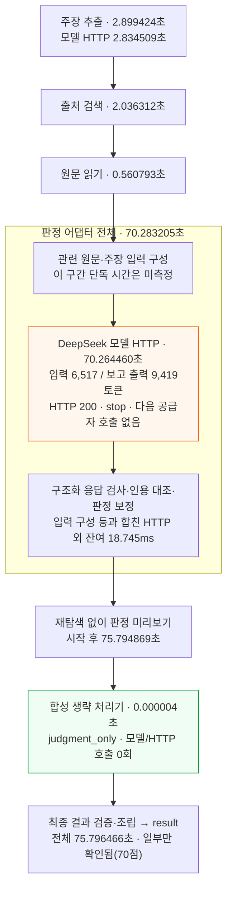
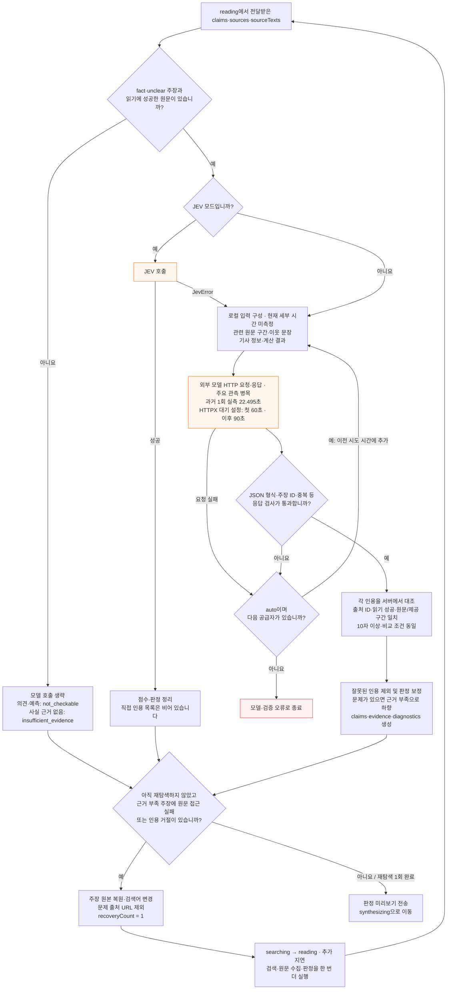
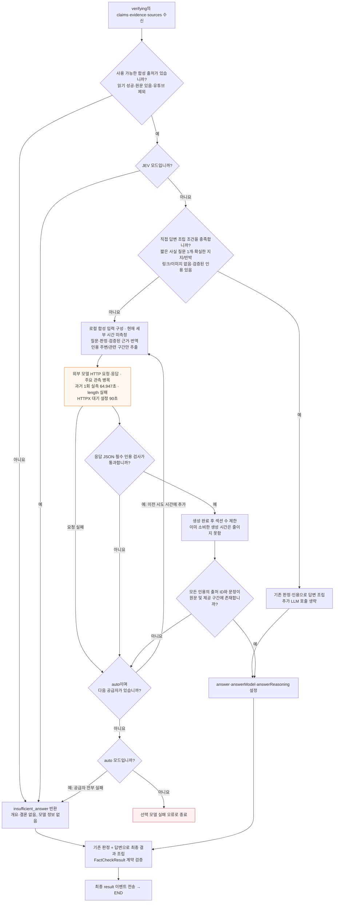

# Search 작업현황

기준일: 2026-10-08. 역할: `feat/search` 분기의 완료·남은 작업을 기록합니다. 제품 정책과 전체 T/D 목록은 [작업현황](작업현황.md)을 따릅니다.

## 완료

| 일자 | 작업 | 결과물 | 확인 상태 |
|---|---|---|---|
| 2026-10-08 | Agent State·Node 설계 초안 작성 | `docs/agent-state-node.md` 신규 생성. State 8개 필드와 5개 Node(입력 분석→출처 검색→원문 수집→주장 검증→최종 응답) 정의 | 파일 읽기 확인 완료. `backend/workflow.py`의 5단계 흐름과 대조하였으며, 실공급자·원격 검증은 미실시 |
| 2026-10-08 | YouTube 검증 5회 반복 재현 | 동일 입력 5회 전송. 성공 4회(9~226초)·TIMEOUT 1회, 재탐색 3회 동작·동작 시 모두 성공. [기록](qa/실행기록/2026-10-08-youtube-5회.md) | 스트림 이벤트·소요·최종 상태 확인 완료. 단계별 소요·내부 예외 내용은 미검증 |
| 2026-10-08 | 연근 Shorts 기존 실행 기록 보정 | [영상](https://youtube.com/shorts/1jMps1WcXVo?si=9DsZIRFpowGuY9ZV) 테스트 기록 | 기존 1회 기록은 60초 설정으로 표기했으나, 당시 요청을 받은 8010 서버가 60초 변경 커밋 이전 리비전으로 구동된 사실을 확인했습니다. 기존 240초 `TIMEOUT`은 60초 비교 데이터에서 제외합니다 |
| 2026-10-08 | 연근 Shorts 60초·90초 비교 각 3회 | 같은 질문·focus·영상 URL, `auto` 모델로 60초·90초 서버를 분리해 교대로 실행 | 60초: 3/3 `TIMEOUT`(각 240초); 2회 합성 진입. 90초: 1/3 완료(145.6초), 1회 합성 중 `TIMEOUT`(240.1초), 1회 판정 중 `AGENT_FAILED`(224.6초). 완료 결과는 `partially_supported`, 주장 1건·출처 2개·근거 6개. 성공한 90초 실행의 첫 판정은 39.9초로 60초 제한 안에 있어, 소표본 결과만으로 90초가 성공 원인이라고 단정할 수 없습니다. 전체 스트림 제한은 두 조건 모두 240초 |
| 2026-10-08 | 판정 구조화 출력 임시 A/B (DeepSeek V4.1 Flash) | 동일한 합성 주장·근거로 현재 JSON 모드와 JSON 모드 해제(스키마 지시는 동일)를 각 2회 실행. 판정 함수만 호출했고 검색·읽기는 생략했습니다 | JSON 모드: 12.19초·18.57초(평균 15.38초), 2/2 형식·근거 검증 통과; 근거 부족(20점·근거 1개), 대체로 뒷받침(82점·근거 2개). JSON 모드 해제: 14.69초·15.77초(평균 15.23초), 2/2 통과; 일부 뒷받침(68점·근거 1개), 대체로 뒷받침(80점·근거 1개). 평균 차이 0.15초는 의미 있는 속도 차이로 보기 어렵고, 합성 입력·조건별 2회라 정확도 비교는 아닙니다 |
| 2026-10-08 | 판정·답변 작성 노드 상세 흐름 작성 | 이 문서의 판정·답변 작성 상세 흐름도 2개와 모델 대체·재탐색·시간 제한 정리 | 실제 코드 대조 및 문서 공백 검사 완료. 실공급자·성능 재측정과 Mermaid 렌더 화면 검증은 미실시 |
| 2026-10-08 | 판정·답변 작성 내부 지연 분석 | 과거 실측의 HTTP/로컬 시간 분해, 흐름도에 병목·시간 누적 경로 표시, 현행 시간 제한 의미 정정 | 수치·코드·HTTPX 공식 문서 대조 완료. 원래 표의 시도별 지연과 현행 성능 실측은 미확인 |
| 2026-10-08 | 합성 제외 실서비스 1회 실행 | 최신 feat/agent 리비전 18d26ed의 독립 런타임, 다이아몬드 비 주장·auto/MAX | 75.796466초 완료. 판정 70.283205초(HTTP 70.264460초), 합성 모델 0회·재탐색 0회, 일부만 확인됨(70점). 기존 서버·브라우저 전체 경로는 미검증 |

## 합성 제외 1회 실행 — 2026-10-08

**합성 모델을 호출하지 않은 최신 백엔드 독립 실행은 75.796466초에 완료했습니다. 판정은 전체의 92.726%이며, 판정 내부의 99.973%가 모델 HTTP 요청·응답 구간이었습니다.** 공급자 대체와 재탐색은 모두 0회였습니다.

### 실행 조건과 결과

| 항목 | 실제 실행 값 |
|---|---|
| 입력 | 목성과 토성에서는 다이아몬드 비가 내린다. |
| focus / consent | 과학 주장 확인 / true |
| 모델 선택 / 실제 모델 / 추론 | auto / deepseek-v4.1-flash / max |
| 코드 | 기본 작업 폴더 feat/agent의 리비전 18d26ed를 새 Python 프로세스에서 로딩했습니다. 합성 생략은 기존 ed42c52 변경이며 이번에 앱 코드를 수정하지 않았습니다. |
| 실행 경계 | load_settings·FactCheckRequest 검증·make_runtime_adapters로 실행을 준비하고 build_runtime_workflow → stream_events(timeout=240)를 호출했습니다. 모델·검색·원문 수집은 실제 서비스이며 모의 응답을 사용하지 않았습니다. |
| 완료 시각 | 2026-10-08 16:35:28 KST, checkedAt=2026-10-08T07:35:28.039242+00:00 |
| 최종 결과 | result 수신, 오류 없음. 일부만 확인됨(partially_supported), 70점. 출처 5개·근거 4개. |
| 합성 생략 확인 | answer.status=judgment_only, answer.model=null. 합성 처리기에서 HTTP 요청 0회·모델 호출 0회. |
| 모델 호출 / 재탐색 | 추출 1회·판정 1회, 총 2회 / 재탐색 0회. 두 모델 응답 모두 HTTP 200, stop 종료. |

### 시간이 걸린 위치

노드 어댑터의 진입·반환을 perf_counter로 측정했습니다. 아래 시간은 어댑터 전체이며 각 단계의 스트림 이벤트 간격과 동일한 경계는 아닙니다.

| 단계 | 어댑터 시간 | 모델 HTTP 시간 | 확인된 내용 |
|---|---:|---:|---|
| extracting — 주장 추출 | 2.899424초 | 2.834509초 | DeepSeek 1회, 정상 완료 |
| searching — 출처 검색 | 2.036312초 | 별도 LLM 호출 없음 | 실제 검색 어댑터 전체 시간 |
| reading — 원문 읽기 | 0.560793초 | 별도 LLM 호출 없음 | 실제 원문 읽기 어댑터 전체 시간 |
| verifying — 판정 | 70.283205초 | 70.264460초 | HTTP 외 잔여 합계 18.745ms. 전체 실행 시간의 92.726% |
| synthesizing — 생략 상태 반환 | 0.000004초 | 0초 | judgment_only 반환, 외부 호출 없음 |
| 어댑터 밖 처리 합계 | 0.016728초 | — | 그래프·이벤트·결과 조립 등 전체와 어댑터 합계의 차이. 세부 함수별 시간은 미측정 |
| 전체 스트림 실행 | **75.796466초** | — | 최종 result까지 완료 |

판정 HTTP는 네트워크·게이트웨이·공급자 대기/처리·응답 수신을 포함합니다. 모델 내부 추론과 본문 생성 시간을 분리한 수치는 아닙니다. 입력 구성·구조화 응답 처리·인용 대조 등 로컬 작업은 잔여 18.745ms 안에 함께 포함되며 각각 독립 측정하지 않았습니다.

| 관측 이벤트 | 시작 후 시각 |
|---|---:|
| extracting | 0.000103초 |
| searching | 2.908376초 |
| reading | 4.946513초 |
| verifying | 5.508872초 |
| 판정 preview | 75.794869초 |
| synthesizing | 75.794940초 |
| 최종 실행 종료 | 75.796466초 |

synthesizing 이벤트부터 종료까지는 1.526ms입니다. 이 구간에는 생략 어댑터뿐 아니라 결과 검증·조립·이벤트 전달이 포함됩니다. 이벤트 이름은 남아 있지만 별도 답변 생성은 실행하지 않았습니다.

### 실행 명령·관측 방법과 확인 범위

| 작업 | 실행 명령·방법 | 실제 결과 |
|---|---|---|
| 사전 확인 | git status --short --branch, git log -1; Python httpx로 8010 /health와 /api/fact-check 조회 | 기존 서버 revision=9fbb3c5-dirty, 설정된 모델 사용 가능. 키·헤더·원문은 출력하지 않았습니다. |
| 중단 요청 | 8010 /api/fact-check에 동일 입력 전송 후 스트림 관찰, 클라이언트 Ctrl+C | 서버 리비전이 합성 제거 전 커밋을 가리켜 합성 제외를 보장할 수 없었습니다. 24.480초의 synthesizing 이벤트까지 관측하고 중단했습니다. 최종 result 없음·합성 모델 호출 여부 미확인으로 성공 표본에서 제외합니다. |
| 유효한 독립 실행 1회 | backend에서 인라인 Python을 & '.venv/Scripts/python.exe' -u -X utf8 - 로 실행 | 실행 전 inspect.getsource(adapters.synthesize)의 judgment_only 반환을 확인했습니다. 최신 런타임의 실서비스 스트림을 1회 완료했습니다. |
| 계측 | dataclasses.replace로 어댑터를 래핑하고 perf_counter로 측정. ContextVar로 단계 구분, httpx.AsyncClient.request 래핑으로 구조화 모델 호출의 HTTP·사용량 관찰 | 추출 2.834509초/입력 647·보고 출력 111토큰, 판정 70.264460초/입력 6,517·보고 출력 9,419토큰. 모두 stop. 합성 호출 0회 확인. 프로세스 안에서만 래핑하고 종료 시 원래 메서드로 복원했습니다. |
| 문서 검증 | git diff --check, Python으로 단계 합계·판정 HTTP 잔여·비율 재계산, 변경 diff 확인 | 공백 검사 통과. 어댑터 합계 75.779738초, 잔여 16.728ms, 판정 HTTP 잔여 18.745ms, 판정 비중 92.726%를 대조했습니다. Mermaid 렌더 화면은 미검증입니다. |
| 종료·보존 | 진단 프로세스 정상 종료(exit 0), Get-NetTCPConnection -State Listen -LocalPort 3000,8010 | 기존 서버 PID 14284(3000)·15472(8010)을 유지했습니다. 추가 서버를 시작하지 않았습니다. |

이 유효 실행의 전체 시간은 스트림 시작부터 종료까지입니다. Python 시작·모듈 로딩·설정 로딩·그래프 구성, 브라우저·Next.js 프록시·기존 API 서버·intent·대화 DB 저장은 측정 범위에 포함하지 않았습니다. 일반 원문 다운로드의 모든 HTTP 요청을 개별 계측한 결과도 아닙니다. 8010 서버를 최신 코드로 재시작하거나 배포한 결과로 해석하지 않습니다.

비교 참고: 기본 작업 폴더의 docs/agent/지연테스트-정리.md에는 2026-10-07 동일 주제 1회가 전체 약 237초·판정 약 42초·합성 약 190초(4개 공급자 후 실패)로 기록되어 있습니다. 이번 실행은 약 75.80초·판정 약 70.28초·합성 모델 0회입니다. 과거 값은 반올림된 별도 코드·시점·검색 결과의 기록이고 입력 문장 부호도 달라, 동일 조건 A/B나 평균 속도 개선율로 사용하지 않습니다. 합성을 제외해도 이번 판정 자체에는 70초가 걸렸다는 점이 확인된 결과입니다.

남은 확인: 처음 표의 54·122·31·229초를 만든 입력/모델/시도별 기록, 공급자 내부 대기·추론·생성의 분리, 동일 리비전·동일 입력의 반복 비교, 기존 서버·브라우저 전체 경로의 합성 생략 검증입니다. 상시 계측 코드는 추가하지 않았습니다.

## 시간이 걸리는 위치와 확인된 병목

아래 분석과 합성 포함 상세 흐름도는 별도 작업 폴더의 feat/search 코드 기준입니다. 앞 절의 합성 제외 실측은 feat/agent 리비전 18d26ed 기준이며 서로 다른 코드입니다. 아래 두 내부 흐름도의 주황색 노드는 외부 모델 요청 구간이며, 재시도 화살표는 동일 단계의 요청 시간이 다시 더해지는 경로입니다.

### 기존 실측으로 확인된 시간

2026-10-05의 질문 “인류는 달에 갔나?” 1회 실행에서 판정·답변 작성 시간의 99.9% 이상은 외부 모델 HTTP 요청·응답 구간이었습니다. 외부 구간에는 연결·네트워크·게이트웨이·공급자 대기 및 처리·응답 수신이 함께 포함됩니다. 이것을 모델의 추론 시간만으로 설명하지 않습니다.

| 노드 | 노드 전체 시간 | 외부 모델 HTTP 구간 | HTTP 외 처리 합계 | HTTP 비중 | 실행 결과 |
|---|---:|---:|---:|---:|---|
| verifying — 판정 | 22.509초 | 22.495초 | 14.38ms | 99.936% | 구조화 판정 완료 |
| synthesizing — 답변 작성 | 64.961초 | 64.947초 | 13.77ms | 99.979% | 출력 한도 도달(length), 불완전 응답 거부 |

근거: [2026-10-05 단일 지연 측정](qa/실행기록/2026-10-05-지연측정.md). HTTP 외 처리 시간은 노드 전체에서 내부 HTTP 시간을 뺀 값입니다. 입력 준비·클라이언트 준비·응답 처리 등을 합한 잔여 시간이며 각 함수의 독립 측정값은 아닙니다. 합성은 length 응답을 받은 뒤 실패했으므로 정상 답변의 인용 검사를 끝내는 데 걸린 시간으로 해석하지 않습니다.

이 실행에는 공급자 폴백·재탐색·같은 단계의 HTTP 재요청이 없었습니다. 따라서 이 사례의 긴 대기를 재시도 탓으로 설명할 수 없습니다. 판정 입력/보고 출력은 17,329/3,175토큰, 합성 입력/보고 출력은 8,974/16,000토큰이었습니다. 합성은 요청한 16,000토큰을 모두 사용하고 length로 종료했습니다. 보고 출력에는 추론이 포함될 수 있으며 본문·인용 생성과 추론의 토큰/시간을 따로 수집하지 않았습니다.

위 기록은 직접 답변 조립과 관련 구간·근거 패킷 도입 전 자료입니다. 2026-10-06 이후 현재 코드의 동일 시간이나 평균으로 재사용하지 않습니다. 처음 제시한 약 54/122초, 약 31/229초의 실행은 입력·모델·호출별 기록이 확인되지 않아 해당 시간을 내부 구간별로 나누지 못했습니다.

### 현재 코드에서 대기가 길어지는 경로

| 위치 | 실제로 하는 작업 | 지연에 대한 확인 수준 |
|---|---|---|
| 판정 LLM 요청 | 점수·판정·요약·확인/미해결 내용·직접 인용·번역을 함께 생성합니다. | 과거 실측에서 HTTP 구간이 병목이었습니다. 현재 입력별 추론·생성·네트워크의 분리 시간은 미측정입니다. |
| 합성 LLM 요청 | 판정 뒤 별도 요청으로 개요·섹션·결론·직접 인용을 다시 생성합니다. | 두 노드가 순차 실행됩니다. 과거 64.947초 HTTP 구간은 출력 한도 도달 후 실패했습니다. |
| 응답 실패 후 공급자 대체 | 요청 실패·형식 오류·합성 인용 불일치 등으로 다음 공급자를 호출합니다. | 이전 시도에서 쓴 시간을 회수하지 못하고 입력 준비·생성을 다시 수행합니다. 원래 표에서 발생했는지는 미확인입니다. |
| 판정 뒤 재탐색 | 근거 부족과 접근 실패/인용 거절이 함께 있으면 검색 → 원문 읽기 → 판정을 최대 1회 반복합니다. | 전체 요청에 추가 시간을 더합니다. 재탐색 중 검색·읽기 시간은 별도 노드 시간으로 구분해야 합니다. |
| 로컬 입력·검사 | 관련 구간 선택, JSON 검사, 원문 인용 대조, 판정 보정, 결과 조립을 수행합니다. | 과거 실행의 HTTP 외 잔여는 약 14ms였지만 현행 각 함수별 시간은 미측정입니다. |

합성의 섹션 수 제한은 모델 응답을 받은 뒤 적용됩니다. 따라서 사후 삭제된 섹션의 생성 시간을 줄이는 장치는 아닙니다. 모든 문단에 직접 인용을 요구하여 출력할 자료가 많아질 수 있으나, 실제 지연 중 인용 복사에 쓰인 시간을 별도로 입증한 자료는 없습니다.

합성은 판정 결과에 의존하므로 판정과 합성의 외부 호출 시간이 순서대로 더해집니다. 공급자 폴백은 단계 안의 추가 시도이고, 재탐색은 검색·읽기·판정 노드를 한 번 더 실행하는 별도 경로입니다.

### 60·90·240초의 의미

현재 HTTPX 설정은 첫 판정 시도 60초, 이후 판정 시도 및 합성 시도 90초입니다. 이 숫자는 호출 전체의 절대 소요 상한이 아니라 연결·읽기·쓰기·연결 풀의 대기 제한입니다. 읽기 제한은 데이터 청크를 기다리는 시간에 적용됩니다. 따라서 단일 시도의 전체 소요가 90초보다 길 수 있고, 122초라는 값만으로 폴백 횟수를 추정하지 않습니다. [HTTPX 공식 시간 제한 설명](https://www.python-httpx.org/advanced/timeouts/)과 설치본 _config.py를 대조했습니다.

전체 스트림의 asyncio.timeout(240)은 요청 전체의 실제 경과 시간을 제한합니다. 이전 단계·시도·재탐색에서 이미 사용한 시간을 포함하여 240초가 되면 현재 단계가 중단됩니다. 229초 TIMEOUT을 해당 모델이 229초 내내 추론했다는 증거로 사용하지 않습니다.

### 원래 실행의 시간을 정확히 나누려면 필요한 계측

현재 실패 로그에는 단계·모델·예외 종류·HTTP 상태가 있으나, 성공/실패 시도 각각의 소요 시간과 토큰은 기록하지 않습니다. 아래 상시 계측은 운영 코드에 구현하지 않았습니다. 이번 독립 실행에서는 어댑터 전체와 모델 HTTP 구간을 임시 계측했으며 입력 준비·응답 검사 각각의 시간은 아직 구분하지 않았습니다.

| 측정 구간 | 측정 경계와 필요한 값 |
|---|---|
| 노드 전체 | verify/synthesize 시작·종료, 요청 ID, recoveryCount. 판정 1차·2차를 구분합니다. |
| 입력 준비 | 판정의 select_passages·이웃 문장·계산 구성, 합성의 _synthesis_input 시작·종료. 출처/구간 수와 직렬화 문자 수만 기록합니다. |
| 외부 호출 시도별 | request_structured 및 client.post 시작·종료, 단계·모델·시도 번호·HTTP 상태·예외 종류. 실패 시도도 포함합니다. |
| 응답 처리·검증 | 응답 JSON 처리, 판정 ground_judgments, 합성 형식 검사·인용 검사, 최종 결과 조립을 각각 측정합니다. |
| 공급자 사용량 | 공급자가 제공한 입력/출력/추론 토큰 수와 종료 이유를 기록합니다. 원문·응답 본문·내부 추론·키·헤더는 기록하지 않습니다. |

시도별로 “입력 준비 + 외부 요청 + 응답 처리/검증”을 합하고, 노드 밖 미리보기·검색·읽기·재탐색 시간을 별도로 비교하면 원래 표의 54·122·31·229초가 한 번의 긴 요청인지, 실패한 요청의 누적인지 구분할 수 있습니다. 외부 구간 안의 게이트웨이 대기·모델 추론·본문 생성은 이 경계 계측만으로 완전히 분리되지 않습니다. 공급자가 해당 시각·사용량을 제공하는 범위까지 확인해야 합니다.

앞선 구조 분석에서는 기존 측정 기록·호출 경계·HTTPX 계약만 대조했습니다. 이후 사용자가 요청한 합성 제외 실서비스 1회 실행은 위 절에 기록했으며 운영 코드 변경은 없었습니다.

## 판정·답변 작성 노드 상세 흐름

실제 실행 순서는 `verifying`(판정) → `synthesizing`(답변 작성)입니다. 아래 흐름은 `runtime.py`, `runtime_adapters.py`, `verification.py`, `answer_synthesis.py`, `recovery.py`, `workflow.py`, `streaming.py`, `providers.py`의 내부 처리와 대조했습니다.

### verifying — 판정

### synthesizing — 답변 작성

### 공통 규칙과 예외

- 자동 선택은 키가 설정된 공급자만 DeepSeek → Luna → Gemini 3.8 → Gemini 3.7 순서로 시도합니다. 모델을 명시하면 해당 모델만 사용합니다.
- 공급자 대체와 검색 재탐색은 별개입니다. 공급자 대체는 단계 안에서 순차 실행하며, 검색 → 읽기 → 판정 복귀는 요청당 최대 1회입니다.
- `stream_events`는 전체 요청을 240초로 제한합니다. 시간 초과는 현재 단계에서 중단하고 `TIMEOUT` 이벤트를 전송합니다. 노드별 시간은 전체 제한 안에서 누적됩니다.
- 합성의 `NOT_CONFIGURED`·`SYNTHESIS_FAILED`와 사전 출처 부족은 고정 근거 부족 답변으로 처리됩니다. 명시한 모델의 `MODEL_FAILED`·`MODEL_UNAVAILABLE` 및 다른 예외는 오류로 전파됩니다.
- 최종 결과 계약 검사 실패는 `AGENT_FAILED`로 종료됩니다. TIMEOUT 뒤에 자동 재요청하지 않습니다.
- 직접 조립 조건은 `direct_fact_answer` 전체 검사를 따릅니다. 경고·복구 요청·부적합한 인용 등이 있으면 모델 합성으로 진행합니다.

## 남은 작업

| 항목 | 다음 행동 |
|---|---|
| 설계 검토 | State·Node 정의와 실제 `FactCheckState` 간 차이(학습용 간소화 여부)를 확정합니다. |
| 원래 실행의 지연 분해 | 표를 측정한 입력·모델·측정 시점과 시도별 기록을 확보한 뒤, 같은 조건에서 입력 준비·외부 호출·응답 검증·폴백·재탐색 소요를 구분합니다. 합성 제외 실행 1회에서 어댑터·모델 HTTP 시간은 임시 측정했습니다. 원래 표의 실행 및 세부 함수별 시간은 미확인입니다. |
| 문서 정합 | 필요시 [작업현황](작업현황.md)·[아키텍처](아키텍처.md)와의 연결을 정리합니다. |
