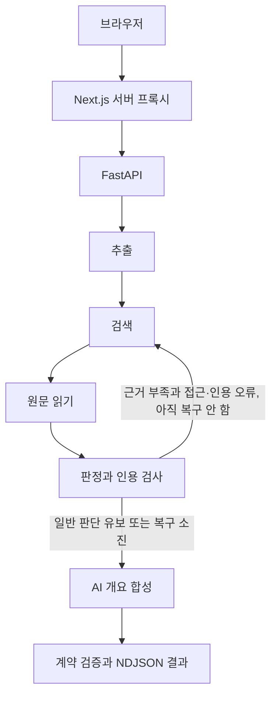

# True or Not 아키텍처

기준일: 2026-10-03. 역할: 현재 코드의 흐름·모델·API·계약·제한. 코드 기준은 `df30011`과 이후 미커밋 변경이다. 제품 정책은 [기획서](기획서.md), 문제·미결정 사항은 [작업현황](작업현황.md), 실행 증거는 [QA](qa/검증기준.md)에서 관리한다.

## 구성과 모델

Next.js App Router UI와 서버 프록시가 FastAPI·LangGraph 백엔드에 연결된다. 모델·검색 키는 서버에만 둔다. 브라우저에 공급자 키를 전달하지 않는다.

| Auto 순서 | 모델 | 모든 해당 모델 호출의 추론 설정 | 공급자 API |
|---|---|---|---|
| 1 | GPT-6 Luna (`gpt-6-luna`) | `reasoning.effort=max`, `service_tier=fast` | OpenAI Responses |
| 2 | Gemini 3.8 Flash | `thinking_level=high` | Gemini Interactions |
| 3 | Gemini 3.7 Flash | `thinking_level=high` | Gemini Interactions |

추출·검색·판정·AI 개요·내용 요약·intent에서 Luna를 호출할 때도 MAX를 유지한다. 키가 없는 공급자는 제외하고 Auto는 단계별 실패 시 설정된 다음 공급자를 시도한다. 개별 모델 선택은 해당 모델만 사용한다. 기준은 [providers.py](../backend/providers.py)와 [schemas.py](../backend/schemas.py)다. API 인증·과금은 ChatGPT/Codex 구독과 별개이며 Fast 지원·요금·계정 권한은 실제 공급자에서 확인한다.

## 검증 그래프

- 추출: 최대 3개 주장과 검색어를 만들고 원문 범위를 검사한다. 링크 단독 본문은 모델 호출 전 UTF-16 12,000 단위로 자르며 이미지 관측 본문은 입력 본문을 대체한다.
- 검색: Tavily 키가 있으면 우선 사용하고 실패·미설정이면 모델 웹검색으로 대체한다. 사용자가 제공한 안전한 링크와 실제 검색 메타데이터 URL을 수집 대상으로 삼는다. 일본어 후보·본문 제외 규칙과 Naver Knowledge iN 제외가 있다.
- 읽기: 본문·섹션·제목·최종 URL을 수집한다. 링크 제목의 추가 검색은 Tavily가 있을 때 수행하며 재탐색 때 반복하지 않는다. 접근 실패·검색 요약은 직접 인용 근거로 만들지 않는다.
- 판정: 주장 주변 문장·기사 정보와 원문을 전달한다. 정확한 인용·참조·비교 조건을 검증해 판정을 조정한다. 수치 계산 보조는 연결되어 있으나 오류 사례가 있어 T13에서 관리한다.
- 합성: 읽은 `verified` 비-YouTube 출처의 본문으로 AI 개요를 만든다. 출처 ID와 실제 인용 문자열을 대조한다. 근거 없음·생략·생성 실패가 현재 같은 답변 상태로 합쳐지는 문제는 T14다.

기준 코드: [workflow.py](../backend/workflow.py), [runtime.py](../backend/runtime.py), [verification.py](../backend/verification.py), [answer_synthesis.py](../backend/answer_synthesis.py).

## 최대 1회 재탐색

[review_recovery](../backend/recovery.py)는 사실·유형 불명확 주장이 `insufficient_evidence`이고 원문 접근 실패 또는 해당 주장의 인용 거절 진단이 있을 때 복귀를 선택한다. 일반 근거 부족·의견·예측·입력 오류·공급자 예외에는 이 루프를 강제하지 않는다.

1. 원문·추출 주장 스냅샷을 보존하고 해당 검색어에 “공식 원문”을 추가한다.
2. 접근 불가·거절된 인용 출처의 URL과 최종 URL을 제외한다. 정상 출처는 새로 읽을 후보로 유지한다.
3. 기존 본문·섹션·근거·진단 상태를 지우고 검색→읽기→검증을 다시 실행한다. 제외 URL의 추적 파라미터 변형·리다이렉트 유입도 검사한다.
4. 요청 전체 `recoveryCount`는 최대 1이며 소진 후 합성으로 진행한다. 전체 스트림 시간 제한을 초기화하지 않는다.

원인·대상·검색어·제외 URL·결과는 내부 `recoveryTrace`에 기록한다. 공개 결과에 전체 진단 스키마를 추가하지 않았으며 화면에는 반복 단계와 결과 경고를 전달한다. 첫 미완성 판정 미리보기는 보내지 않고 재탐색의 빈 출처 목록도 전달한다. JEV 단독 빠른 API에는 이 그래프 루프가 없다. 공급자 폴백·사용자 재요청·QA 실행기의 HTTP 재요청은 별도다.

## 보조 경로와 출처

| 경로·데이터 | 현재 동작 |
|---|---|
| intent | 짧은 입력과 이전 원문·주장·최근 메시지 일부를 사용해 검증 또는 대화 답변을 분류. 동의 계약 없음 |
| 내용 요약 | 붙여넣기·링크·30분 미만 영상 자막 요약. 사실 판정·이미지 요약은 하지 않음 |
| 메인 그래프 JEV 옵션 | 추출 후 JEV 판정. 실패 시 LLM으로 전환하며 현재 전환 안내가 부족 |
| JEV 빠른 API | 입력 전체를 `fact` 주장 하나로 만들고 검색→읽기→JEV 판정. 이미지 거부. 실패는 오류 또는 LOW_CONFIDENCE 유보 처리 |
| YouTube | 확보한 자막은 판정 근거로 사용 가능. 공개 댓글 최대 10개는 맥락용이며 LLM·판정 근거로 사용하지 않음. AI 개요의 YouTube 인용 제외 |
| 시장 맥락 | 주식 탐지 시 Finnhub 시세·60일봉 조회. 실패해도 검증 계속. 재탐색 때 기존 시장 결과 재사용. 계약상 최대 90개 일봉·`krx` 예약 값, 실제 KRX 어댑터 없음 |

주식 질문은 investing.com·reuters.com·wsj.com·bloomberg.com을 금융 정보 참고 매체로 우선 정렬한다. 출처 선택 순서이며 판정·정확도 점수 가산점이 아니다.

URL 정규화와 최종 URL 중복 제거를 수행한다. 후보의 호스트 그룹에 더해 읽기 후 공백 정규화한 본문 앞 6,000자에서 60자 이상 공통 문구가 있는 출처를 `shared-*`로 묶는다. 공통 인용 단서이며 최초 작성자·재인용 방향·전체 독립성을 증명하지 않는다. 현재 공통 그룹 둘 이상 출처를 발견하면 전체 계보 미확인 경고가 생략되는 동작은 T20에서 개선한다.

## API와 계약

| 브라우저 프록시 | 백엔드 | 용도 |
|---|---|---|
| 없음 | GET `/health` | 생존·리비전. Docker의 리비전 식별 공백은 T16 |
| GET `/api/fact-check` | GET `/api/fact-check` | 모델·설정·워크플로 상태 |
| POST `/api/fact-check` | POST `/api/fact-check/stream` | NDJSON 검증 |
| 없음 | POST `/api/fact-check` | 단일 JSON 검증. QA 실행기가 사용 |
| POST `/api/fact-check/jev` | 같은 경로 | JEV 빠른 판정 |
| POST `/api/intent` | 같은 경로 | 의도 분류·대화 |
| POST `/api/summarize` | 같은 경로 | 내용 요약 |

요청·결과의 전체 필드는 [schemas.py](../backend/schemas.py), [contracts.py](../backend/contracts.py), [프론트 계약](../app/lib/fact-check-contract.ts)을 따른다.

- 요청: `text`, `focus`, `consent=true`, `modelPreference`, 선택적 `linkUrl`·`image`, `jevMode`. 알 수 없는 필드는 거부한다.
- 결과: 원문·주장·출처·근거·판정·경고·검증 시각·모델·추론·개요·선택적 시장 맥락. 주장·출처·근거 ID와 인용 무결성을 검사한다. 발행일 미확인은 `null`이다.
- 원문 위치: UTF-16 코드 단위 `start` 포함·`end` 제외. 한글·이모지·줄바꿈과 화면 연결은 QA로 확인한다.
- 판정 코드: `mostly_supported`, `partially_supported`, `missing_context`, `conflicting_sources`, `insufficient_evidence`, `not_checkable`, `contradicted`.
- 점수 밴드: 0~19·20~39·40~59·60~79·80~100. 판정과 별개로 읽는다. 현재 화면·채팅은 평균도 표시하며 정책은 D1 미결정이다.

## 제한과 스트림

| 항목 | 현재 코드 값 |
|---|---|
| 본문·확인 요청 | UTF-16 12,000·500 단위 |
| 링크·이미지 | 링크 2,048자, HTTP(S)·자격증명/명시적 포트 불가. JPEG/PNG/WebP, 디코딩 1,500,000바이트 이하 |
| 주장·출처 | 최대 3개·6개. 링크 본문과 후보를 같은 상한 안에서 처리 |
| 개요 입력 | 비-YouTube verified 출처 최대 6개, 출처별 6,000자 |
| 본문 읽기 | 전체 8초, 응답 최대 512,000바이트를 읽어 파싱 |
| 모델·Tavily | 모델 클라이언트 90초, Tavily 쿼리별 요청 20초 |
| 메인 스트림 | 백엔드 240초, 프록시 245초, 프록시 응답 총 2MB |
| 보조 프록시 | JEV 180초, intent 25초, 요약 120초 |
| 동시 실행 | 메인 프록시 프로세스당 1건. 보조 API·백엔드의 사용자별 한도 없음 |
| 본문 크기 검사 | 메인 프록시 제한 읽기 3,000,000바이트, JEV 200,000. intent·요약은 전체 읽기 후 20,000자 검사 |

NDJSON은 `stage`·`sources`·`preview`·`result`·`error`를 전달한다. 검색→읽기→검증은 재탐색 때 한 번 반복할 수 있다. 취소는 별도 API 대신 연결 종료와 upstream 취소로 전파한다. 메모리 기반 실행이며 `runId`·영속 큐·재시작 후 작업 복구는 없다. 취소 전에 사용된 외부 API 비용의 환불·과금 중단을 보장하지 않는다.

주요 공개 오류는 `INVALID_REQUEST`, `LOCAL_ONLY`, `BUSY`, `CANCELLED`, `NOT_CONFIGURED`, `AGENT_FAILED`, `BACKEND_UNAVAILABLE`, `BACKEND_FAILED`, `TIMEOUT`, `INTENT_FAILED` 및 JEV 오류 코드다. 구현 기준은 [main.py](../backend/main.py), [streaming.py](../backend/streaming.py), [메인 프록시](../app/api/fact-check/route.ts)다.

## 데이터·운영 경계

기본 프록시는 로컬 요청과 loopback HTTP 백엔드를 제한한다. Render 공개·원격 HTTPS 게이트와 서버 공유 시크릿은 [배포](배포.md)에서 설정한다. 공유 시크릿은 프록시↔백엔드 보호이며 공개 이용자의 인증·한도는 아니다.

검증·JEV·요약 API는 동의 값이 필수이나 화면은 자동 입력하고 intent에는 검사 계약이 없다. 사설 IP·DNS·리다이렉트 검증은 [sources.py](../backend/sources.py)에 구현되어 있다. 이미지 MIME과 실제 바이트 대조는 미구현이다.

서버에 계정·검증 이력을 영속 저장하지 않는다. YouTube API 메타데이터·댓글은 JSON 내보내기에서 제외한다. 외부 공급자의 보존 정책은 별도이며 `store:false`를 모든 보존이 없다는 뜻으로 설명하지 않는다. 공개 안내문과 자막 기능의 불일치는 T26이다.

공식 API 참고: [OpenAI Responses·웹검색](https://developers.openai.com/api/docs/guides/tools-web-search), [구조화 출력](https://developers.openai.com/api/docs/guides/structured-outputs), [Gemini Interactions](https://ai.google.dev/gemini-api/docs/interactions-overview). 실제 공급자 권한·요금·원격 성공은 QA 기록과 구분한다.
