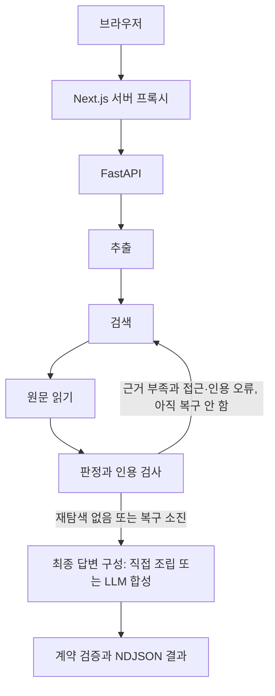

# True or Not 아키텍처

기준일: 2026-10-06. 역할: 현재 코드의 흐름·모델·API·계약·제한. `62f394e` 이후 관련 원문 구간과 검증 근거 패킷 입력을 반영한다. 제품 정책은 [기획서](기획서.md), 문제·미결정 사항은 [작업현황](작업현황.md), 실행 증거는 [QA](qa/검증기준.md)에서 관리한다.

## 구성과 모델

Next.js App Router UI와 서버 프록시가 FastAPI·LangGraph 백엔드에 연결된다. 모델·검색 키는 서버에만 둔다. 브라우저에 공급자 키를 전달하지 않는다.

| Auto 순서 | 모델 | 모든 해당 모델 호출의 추론 설정 | 공급자 API |
|---|---|---|---|
| 1 | DeepSeek V4.1 Flash (`deepseek-v4.1-flash`) | `reasoning_effort=max`, JSON 모드 + 서버 검증 | Experiential Chat Completions |
| 2 | GPT-6 Luna (`gpt-6-luna`) | `reasoning.effort=max`, `service_tier=fast` | OpenAI Responses |
| 3 | Gemini 3.8 Flash | `thinking_level=high` | Gemini Interactions |
| 4 | Gemini 3.7 Flash | `thinking_level=high` | Gemini Interactions |

2026-10-05 보완: DeepSeek의 텍스트·이미지 구조화 호출은 `EXPLABS_API_KEY`와 고정 Experiential 주소만 사용하고 MAX를 유지한다. JSON Schema 강제 대신 JSON 모드·스키마 안내·기존 서버 검증을 사용하며 추론과 최종 JSON이 공유하는 최소 출력 예산은 16,000토큰이다. 추출·검색·판정·AI 개요·내용 요약·intent에서 Luna를 호출할 때도 MAX/Fast를 유지한다. 키가 없는 공급자는 제외하고 Auto는 단계별 실패 시 설정된 다음 공급자를 시도한다. 개별 모델의 구조화 호출은 해당 모델만 사용하되, DeepSeek의 검색 단계는 내장 검색이 없어 기존 Tavily 또는 GPT/Gemini 도구를 사용한다. NDJSON·취소·기존 검색 도구 계약은 변경하지 않는다. 기준은 [providers.py](../backend/providers.py)와 [schemas.py](../backend/schemas.py)다. API 인증·과금은 ChatGPT/Codex 구독과 별개다. 초기 연결 호출의 Experiential 크레딧 경로와 미검증 범위는 [QA 기록](qa/실행기록/2026-10-05-DeepSeek.md), 이후 한도 보완은 [출력 한도 기록](qa/실행기록/2026-10-05-DeepSeek-출력한도.md)을 따른다.

## 검증 그래프

State 필드별 작성자·수명, Node 입력·출력과 재탐색 전이는 [Agent State Node 설계서](Agent-State-Node-설계서.md)를 참고합니다.

- 추출: 최대 3개 주장과 검색어를 만들고 원문 범위를 검사한다. 링크 단독 본문은 모델 호출 전 UTF-16 12,000 단위로 자르며 이미지 관측 본문은 입력 본문을 대체한다.
- 검색: Tavily 키가 있으면 우선 사용하고 실패·미설정이면 모델 웹검색으로 대체한다. 사용자가 제공한 안전한 링크와 실제 검색 메타데이터 URL을 수집 대상으로 삼는다. 일본어 후보·본문 제외 규칙과 Naver Knowledge iN 제외가 있다.
- 읽기: 본문·섹션·제목·최종 URL을 수집한다. 링크 제목의 추가 검색은 Tavily가 있을 때 수행하며 재탐색 때 반복하지 않는다. 접근 실패·검색 요약은 직접 인용 근거로 만들지 않는다.
- 판정: 주장 주변 문장·기사 정보와 원문을 전달한다. 정확한 인용·참조·비교 조건을 검증해 판정을 조정한다. [수치 계산 보조](../backend/compute.py)는 같은 명시적 단위의 `에서 … 으로/로`, `→`, `->` 변화만 계산한다. 지원 단위는 원·달러·명·개·건과 천·만·억·조 접두 단위이며 단위 내부의 일반 공백·탭만 정규화한다. 단위 없음·다른 지표·환산·범위·분수 표기·연도·비율/퍼센트포인트·음수·지수 표기는 생략한다. 단위가 일치해도 모든 자연어 의미를 해석하는 기능은 아니며, 생략한 계산을 LLM이 임의로 보충하지 않도록 기존 검증 지침을 유지한다.
- 최종 구성: UTF-16 120단위 이하의 물음표 1개로 끝나는 텍스트이고, 사실 주장 1개가 경고/CONDITION_UNKNOWN 없이 지지·반박 판정과 유효한 verified 비-YouTube 직접 인용을 가지면 판정 결과로 답변을 조립한다. 문단 한도 안에서 요약·확인/미해결 내용을 보존하고 원문 인용·계약을 검사하며 추가 LLM 호출과 생성 모델 메타데이터가 없다. 예측/의견·여러 주장·판단 유보·링크/이미지·한도 초과 등은 기존 LLM 합성을 유지한다. JEV·읽을 수 있는 근거 없음 처리도 유지한다. [직접 조립 검증](qa/실행기록/2026-10-05-직접답변.md)을 따른다. 근거 없음·생략·생성 실패의 상태 구분은 여전히 T14다.

기준 코드: [workflow.py](../backend/workflow.py), [runtime.py](../backend/runtime.py), [verification.py](../backend/verification.py), [answer_synthesis.py](../backend/answer_synthesis.py).

### 관련 구간과 근거 패킷 입력

[evidence_context.py](../backend/evidence_context.py)는 기존 추출 검색어(없으면 주장 원문)의 어휘와 일치한 구간 앞뒤 450자를 병합한다. 판정은 본문 앞 6,000자를 무조건 반복 전달하는 대신 해당 발췌를 사용한다. 불일치·언어 차이 등으로 일치 구간이 없거나 전체 선택 범위가 6,000자를 넘으면 기존 앞부분으로 돌아가며 `selection=fallback`으로 표시한다. 짧은 본문은 그대로 전달한다. 이 선택은 의미 기반 완전성 판정이 아니며 발췌에 없다는 이유로 원문 전체에 없다고 결론내리도록 하지 않는다.

최종 합성은 원문에서 검증되고 주장에 연결된 인용·번역·관계와 그 주변 구간을 사용한다. 이미 검증된 인용 창은 입력 한도를 맞추려고 버리지 않는다. 예측/의견이나 검증 인용 없는 출처는 별도 `contextOnly=true`의 관련 맥락 발췌를 사용하고 사실 판정 근거로 승격하지 않는다. 자료는 `passages[{start,end,text}]`로 전달하며 위치는 원문 Unicode 문자 인덱스(입력 주장 오프셋의 UTF-16 단위와 별개)다. 원문 전체와 원문 섹션은 서버에 보존한다. 모델 인용은 원문 전체와 전달된 하나의 발췌에 모두 일치해야 하며 서로 떨어진 발췌를 이어 만든 인용은 허용하지 않는다. 기존 외부 JSON/NDJSON 계약과 인용문 반환 방식·출력 상한은 바뀌지 않는다. [검증 기록](qa/실행기록/2026-10-06-근거패킷.md)을 따른다.

## 최대 1회 재탐색

[review_recovery](../backend/recovery.py)는 사실·유형 불명확 주장이 `insufficient_evidence`이고 원문 접근 실패 또는 해당 주장의 인용 거절 진단이 있을 때 복귀를 선택한다. 일반 근거 부족·의견·예측·입력 오류·공급자 예외에는 이 루프를 강제하지 않는다.

1. 원문·추출 주장 스냅샷을 보존하고 해당 검색어에 “공식 원문”을 추가한다.
2. 접근 불가·거절된 인용 출처의 URL과 최종 URL을 제외한다. 정상 출처는 새로 읽을 후보로 유지한다.
3. 기존 본문·섹션·근거·진단 상태를 지우고 검색→읽기→검증을 다시 실행한다. 제외 URL의 추적 파라미터 변형·리다이렉트 유입도 검사한다.
4. 요청 전체 `recoveryCount`는 최대 1이며 소진 후 합성으로 진행한다. 전체 스트림 시간 제한을 초기화하지 않는다.

원인·대상·검색어·제외 URL·결과는 내부 `recoveryTrace`에 기록한다. 공개 결과에 전체 진단 스키마를 추가하지 않았으며 화면에는 반복 단계와 결과 경고를 전달한다. 첫 미완성 판정 미리보기는 보내지 않고 재탐색의 빈 출처 목록도 전달한다. JEV 단독 빠른 API에는 이 그래프 루프가 없다. 공급자 폴백·사용자 재요청·QA 실행기의 HTTP 재요청은 별도다.

## 보조 경로와 출처

| 경로·데이터 | 현재 동작 |
|---|---|
| intent | 짧은 입력과 이전 원문·주장·최근 메시지 일부로 검증 또는 대화 답변을 분류. 2026-10-05부터 필수 `consent: true`를 타입 변환 없이 검사 |
| 내용 요약 | 붙여넣기·링크·30분 미만 영상 자막 요약. 사실 판정·이미지 요약은 하지 않음 |
| 메인 그래프 JEV 옵션 | 추출 후 JEV 판정. 실패 시 LLM으로 전환하며 현재 전환 안내가 부족 |
| JEV 빠른 API | 입력 전체를 `fact` 주장 하나로 만들고 검색→읽기→JEV 판정. 이미지 거부. 실패는 오류 또는 LOW_CONFIDENCE 유보 처리 |
| YouTube | 확보한 자막은 판정 근거로 사용 가능. 공개 댓글 최대 10개는 맥락용이며 LLM·판정 근거로 사용하지 않음. AI 개요의 YouTube 인용 제외 |
| 시장 맥락 | 주식 탐지 시 Finnhub 시세·60일봉 조회. 실패해도 검증 계속. 재탐색 때 기존 시장 결과 재사용. 계약상 최대 90개 일봉·`krx` 예약 값, 실제 KRX 어댑터 없음 |

주식 질문은 investing.com·reuters.com·wsj.com·bloomberg.com을 금융 정보 참고 매체로 우선 정렬한다. 출처 선택 순서이며 판정·정확도 점수 가산점이 아니다.

URL 정규화와 최종 URL 중복 제거를 수행한다. 후보의 호스트 그룹에 더해 읽기 후 공백 정규화한 본문 앞 6,000자에서 60자 이상 공통 문구가 있는 출처를 `shared-*`로 묶는다. 공통 인용 단서이며 최초 작성자·재인용 방향·전체 독립성을 증명하지 않는다. 현재 공통 그룹 둘 이상 출처를 발견하면 전체 계보 미확인 경고가 생략되는 동작은 T20에서 개선한다.

## API와 계약

| 브라우저 프록시 | 백엔드 | 용도 |
|---|---|---|
| 없음 | GET `/health` | 생존·리비전. Docker의 리비전 식별 공백은 T16 |
| GET `/api/fact-check` | GET `/api/fact-check` | 모델·설정·워크플로 상태 |
| POST `/api/fact-check` | POST `/api/fact-check/stream` | NDJSON 검증 |
| 없음 | POST `/api/fact-check` | 단일 JSON 검증. QA 실행기가 사용 |
| POST `/api/fact-check/jev` | 같은 경로 | JEV 빠른 판정 |
| POST `/api/intent` | 같은 경로 | 의도 분류·대화 |
| POST `/api/summarize` | 같은 경로 | 내용 요약 |

요청·결과의 전체 필드는 [schemas.py](../backend/schemas.py), [contracts.py](../backend/contracts.py), [프론트 계약](../app/lib/fact-check-contract.ts)을 따른다.

- 요청: `text`, `focus`, `consent=true`, `modelPreference`, 선택적 `linkUrl`·`image`, `jevMode`. 알 수 없는 필드는 거부한다.
- 최초 동의(T11): 첫 외부 POST 전에 안내·사용자 선택을 받습니다. 안내 버전만 `ton_external_consent` localStorage 키에 저장하며 철회·사이트 데이터 삭제·버전 변경 시 재확인합니다. 저장 차단 시 현재 화면에서만 유지하고 대화 저장 동의와 분리합니다. Next.js의 네 프록시와 FastAPI의 다섯 POST 경로는 동의 누락·false·문자열·숫자·null을 외부 호출 전에 차단합니다. 이 값은 이용자 인증이나 위조 요청 방지 수단이 아닙니다.
- 결과: 원문·주장·출처·근거·판정·경고·검증 시각·모델·추론·개요·선택적 시장 맥락. 주장·출처·근거 ID와 인용 무결성을 검사한다. 발행일 미확인은 `null`이다.
- 원문 위치: UTF-16 코드 단위 `start` 포함·`end` 제외. 한글·이모지·줄바꿈과 화면 연결은 QA로 확인한다.
- 판정 코드: `mostly_supported`, `partially_supported`, `missing_context`, `conflicting_sources`, `insufficient_evidence`, `not_checkable`, `contradicted`.
- 점수 밴드: 0~19·20~39·40~59·60~79·80~100. 판정과 별개로 읽는다. 현재 화면·채팅은 평균도 표시하며 정책은 D1 미결정이다.

## 제한과 스트림

| 항목 | 현재 코드 값 |
|---|---|
| 본문·확인 요청 | UTF-16 12,000·500 단위 |
| 링크·이미지 | 링크 2,048자, HTTP(S)·자격증명/명시적 포트 불가. JPEG/PNG/WebP, 디코딩 1,500,000바이트 이하 |
| 주장·출처 | 최대 3개·6개. 링크 본문과 후보를 같은 상한 안에서 처리 |
| 개요 입력 | 비-YouTube verified 출처 최대 6개, 출처별 6,000자 |
| 본문 읽기 | 전체 8초, 응답 최대 512,000바이트를 읽어 파싱 |
| 모델·Tavily | 모델 클라이언트 90초, Tavily 쿼리별 요청 20초 |
| 메인 스트림 | 백엔드 240초, 프록시 245초, 프록시 응답 총 2MB |
| 보조 프록시 | JEV 180초, intent 25초, 요약 120초 |
| 동시 실행 | 메인 프록시 프로세스당 1건. 보조 API·백엔드의 사용자별 한도 없음 |
| 본문 크기 검사 | 메인 프록시 제한 읽기 3,000,000바이트, JEV 200,000. intent·요약은 전체 읽기 후 20,000자 검사 |

NDJSON은 `stage`·`sources`·`preview`·`result`·`error`를 전달한다. 검색→읽기→검증은 재탐색 때 한 번 반복할 수 있다. 취소는 별도 API 대신 연결 종료와 upstream 취소로 전파한다. 메모리 기반 실행이며 `runId`·영속 큐·재시작 후 작업 복구는 없다. 취소 전에 사용된 외부 API 비용의 환불·과금 중단을 보장하지 않는다.

주요 공개 오류는 `INVALID_REQUEST`, `LOCAL_ONLY`, `BUSY`, `CANCELLED`, `NOT_CONFIGURED`, `AGENT_FAILED`, `BACKEND_UNAVAILABLE`, `BACKEND_FAILED`, `TIMEOUT`, `INTENT_FAILED` 및 JEV 오류 코드다. 구현 기준은 [main.py](../backend/main.py), [streaming.py](../backend/streaming.py), [메인 프록시](../app/api/fact-check/route.ts)다.

## 데이터·운영 경계

기본 프록시는 로컬 요청과 loopback HTTP 백엔드를 제한한다. Render 공개·원격 HTTPS 게이트와 서버 공유 시크릿은 [배포](배포.md)에서 설정한다. 공유 시크릿은 프록시↔백엔드 보호이며 공개 이용자의 인증·한도는 아니다.

검증·JEV·요약 API는 동의 값이 필수이나 화면은 자동 입력하고 intent에는 검사 계약이 없다. 사설 IP·DNS·리다이렉트 검증은 [sources.py](../backend/sources.py)에 구현되어 있다. 이미지 MIME과 실제 바이트 대조는 미구현이다.

정식 로그인·계정은 제공하지 않지만 저장에 동의한 대화 메시지와 최소 검증 결과 스냅샷은 실제 Render PostgreSQL의 `conversations`·`messages` 테이블에 영속 저장한다. Next.js 대화 프록시→FastAPI 저장 API→asyncpg 저장소로 연결하며 목록·복원·이어쓰기·삭제를 구현하고 로컬 앱과 실제 DB에서 검증했다. 구현 기준은 [대화 프록시](../app/lib/server/conversation-proxy.ts), [저장 API](../backend/conversation_api.py), [저장소](../backend/conversation_store.py)다.

2026-10-05 저장 선택 유지 보완: localStorage의 `ton_storage_consent` 안내 버전으로 확정한 선택을 새로고침 후에도 복원한다. 기록 없음·잘못된/이전 버전은 꺼짐이며 저장 해제는 기록을 제거한다. 다른 탭의 해제·사이트 데이터 삭제도 반영하며 저장소 차단은 현재 화면만 적용한다. 대화 본문·소유자 ID·소유권 쿠키는 선택 기록에 넣지 않는다. 대화 소유권은 IP가 아니라 기존 서버 검증 HttpOnly 쿠키로 확인한다.

익명 소유권은 서버가 검증하는 30일 HttpOnly 서명 쿠키로 확인하고 저장 동의는 별도 기본 꺼짐이다. 쿠키 삭제·만료는 기존 대화의 접근 불가를 의미하며 DB 자동 삭제를 뜻하지 않는다. 지속 운영의 보관 기간·자동 삭제·백업과 공개 배포 검증은 미완료다. 전체 수집 원문·첨부 바이너리·공급자 원시 응답·서비스 비밀값·YouTube API 메타데이터·댓글은 대화 결과 스냅샷 저장에서 제외한다. YouTube API 메타데이터·댓글은 JSON 내보내기에서도 제외한다. 외부 공급자의 보존 정책은 별도이며 `store:false`를 모든 보존이 없다는 뜻으로 설명하지 않는다. 공개 안내문과 자막 기능의 불일치는 T26이다.

공식 API 참고: [OpenAI Responses·웹검색](https://developers.openai.com/api/docs/guides/tools-web-search), [구조화 출력](https://developers.openai.com/api/docs/guides/structured-outputs), [Gemini Interactions](https://ai.google.dev/gemini-api/docs/interactions-overview). 실제 공급자 권한·요금·원격 성공은 QA 기록과 구분한다.
