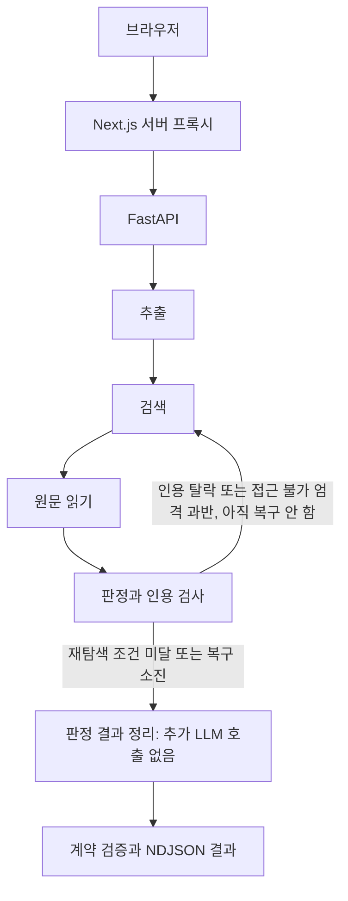
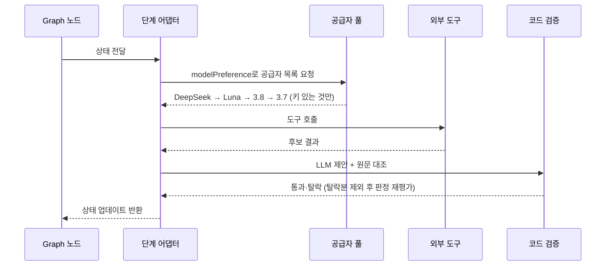

# True or Not 아키텍처

기준일: 2026-10-08. 역할: 현재 코드의 에이전트 구조·흐름·상태·도구 정의. 제품 정책은 [기획서](기획서.md), 문제·미결정 사항은 [작업현황](작업현황.md), 실행 증거는 [QA](qa/검증기준.md)에서 관리한다.

## 1. 서비스 개요

- 서비스명: True or Not
- 목적: 기사·댓글·온라인 주장에서 확인할 주장을 추출하고, 원문 인용·수치·날짜·비교 조건을 연결해 확인된 내용과 불확실한 내용을 함께 보여주는 생활형 검증 도구다. 정답을 선언하지 않는다.
- 주요 사용자: 온라인 주장에 의문을 가진 일반 사용자
- 연계 도구: Tavily 검색, LLM 웹검색(OpenAI·Gemini), YouTube Data API·자막, Finnhub 시세, TypeSafe JEV 판정, PostgreSQL 대화 저장

## 2. StateGraph 노드

그래프 정의는 [workflow.py](../backend/workflow.py), 실행 어댑터는 [runtime.py](../backend/runtime.py)가 맡는다. 그래프 진입 전에 `/api/intent`가 검증·일반답변을 가른다.

| 노드 | 사고 흐름 | 역할 | 주요 입력 | 주요 출력 |
|---|---|---|---|---|
| Intent Gate (그래프 전) | 인지 | 검증 실행과 단순 답변을 구분 | 짧은 입력·이전 원문 | 검증 시작 또는 직접 답변 |
| extracting | 인지 | 최대 3개 주장·검색어 생성, 원문 위치 검증 | text, focus, linkUrl, image | claims, searchQueries |
| searching | 행동 | Tavily 우선, 실패·미설정 시 LLM 웹검색 대체. 주식 탐지 시 시장 맥락 첨부 | searchQueries | sources 후보, market |
| reading | 행동 | 검색 메타데이터 URL만 원문 수집. 접근 실패는 근거로 만들지 않음 | sources 후보 | sources, sourceTexts |
| verifying | 판단 | LLM 판정 제안 → 인용·참조 무결성 코드 검증. JEV 모드 실패 시 LLM 판정으로 전환 | claims, sourceTexts | claims 확정, evidence, diagnostics |
| review_recovery | 판단 | 재탐색 1회 여부 결정 (최대 1회) | 미해결 주장·진단·출처 상태 | recoveryRequested, recoveryCount |
| synthesizing (호환 단계명) | 검증 | 추가 LLM 호출 없이 판정·근거의 최종 계약 검증 및 결과 정리 | claims, evidence, sources | judgment_only, result |

- 추출: 링크 단독 본문은 모델 호출 전 UTF-16 12,000 단위로 자르며 이미지 관측 본문은 입력 본문을 대체한다.
- 검색: 사용자가 제공한 안전한 링크와 실제 검색 메타데이터 URL을 수집 대상으로 삼는다. 일본어 후보·본문 제외 규칙과 Naver Knowledge iN 제외가 있다.
- 읽기: 본문·섹션·제목·최종 URL을 수집한다. 링크 제목의 추가 검색은 Tavily가 있을 때 수행하며 재탐색 때 반복하지 않는다.
- 판정: 주장 주변 문장·기사 정보를 전달하고 [수치 계산 보조](../backend/compute.py)로 같은 명시적 단위의 변화만 계산한다. 단위 없음·다른 지표·환산·범위·분수·연도·비율/퍼센트포인트·음수·지수 표기는 생략한다.
- 최종 구성: 별도 합성 LLM을 모든 메인 검증 입력에서 제거하였다. 채팅은 판정의 요약·확인된 내용·미확인 내용·경고·검증 근거를 직접 표시한다. 예측·의견을 사실 판정으로 바꾸지 않으며 별도 종합 설명은 생성하지 않는다. [합성 제거 검증](qa/실행기록/2026-10-08-합성제거.md)을 따른다.

기준 코드: [workflow.py](../backend/workflow.py), [runtime.py](../backend/runtime.py), [verification.py](../backend/verification.py), [answer_synthesis.py](../backend/answer_synthesis.py).

### 관련 구간과 근거 패킷 입력

[evidence_context.py](../backend/evidence_context.py)는 판정 입력에 사용할 검색어 일치 구간 앞뒤 450자를 병합한다. 일치 구간이 없거나 전체 선택 범위가 6,000자를 넘으면 앞부분으로 돌아가며 `selection=fallback`으로 표시한다. 자료는 `passages[{start,end,text}]`로 전달하고 서버에 보존한 원문과 인용을 대조한다. 최종 합성용 입력 패킷은 합성 호출과 함께 제거하였다. [기존 판정 입력 검증](qa/실행기록/2026-10-06-근거패킷.md)을 따른다.

## 3. 상태 흐름도

### 그래프 종료 조건

| 종료 | 조건 | 결과 |
|---|---|---|
| 정상 완료 | 판정 및 최종 계약 검증 완료 | 판정·근거 직접 표시(`judgment_only`) |
| 근거 부족 종료 | 검증된 인용 없음 | 근거 부족 판정·불확실성을 그대로 표시 |
| 복구 소진 종료 | `recoveryCount >= 1` | 재탐색 없이 결과 정리 |
| 검증 불가 종료 | 의견·예측·입력 오류 | `not_checkable` 또는 오류 코드 |
| 취소 종료 | 브라우저 취소·문서 이탈 | upstream 취소 전파, 늦은 결과 무시 |

## 4. 분기 조건과 예외 폴백

| # | 분기 위치 | 조건 | 참일 때 | 거짓일 때 |
|---|---|---|---|---|
| F1 | 모델 선택 | `modelPreference == "auto"` | DeepSeek → Luna → 3.8 → 3.7 순으로 시도 | 지정 모델만 단독 사용, 실패 시 전환 없음 |
| F2 | 검색 수단 | Tavily 키 설정 + 호출 성공 | Tavily 결과 사용 | LLM 웹검색 대체. 둘 다 불가 시 `LLM_SEARCH_UNAVAILABLE` 경고 |
| F3 | 링크 입력 | 본문이 링크 URL 단독과 일치 | 페이지 본문 수집 후 그 본문으로 추출 | 입력 텍스트로 추출 |
| F4 | JEV 검증 실패 | `JevError` 발생 | 파이프라인 내부 LLM 판정으로 전환. `/jev` 단독 경로는 오류 반환 | JEV 결과 사용 |
| F5 | 최종 결과 정리 | 판정 완료 | 별도 공급자 호출 없이 최종 결과 반환 | 판정·계약 검증 오류는 검증 실패로 반환 |
| F6 | 시장 맥락 | 종목 탐지 + Finnhub 응답 성공 | 시세·차트 첨부 | 맥락 생략 후 검증 계속 |
| F7 | 유튜브 | API 키 설정 + 영상 존재 | 메타·댓글(최대 10개)·자막 수집 | 키 미설정 `not_configured`, 조회 실패 `unavailable` |
| F8 | 재탐색 | 근거 부족 + (인용 탈락 or 접근 불가 엄격 과반·2건 이상) | 검색어에 "공식 원문" 추가, 실패 URL 제외 후 최대 1회 재실행 | 경고를 붙이고 결과 정리 |

## 5. 공유 상태 객체

`FactCheckState`(`backend/workflow.py`, `TypedDict`, `total=False`)가 유일한 공유 상태다.

| 필드 | 타입 | 쓰는 노드 |
|---|---|---|
| `text`, `focus`, `consent`, `modelPreference` | str, str, bool, str | 진입·extracting |
| `linkUrl`, `image`, `jevMode` | str\|None, dict\|None, bool | 진입·extracting |
| `claims`, `searchQueries` | list, dict | extracting → searching·verifying |
| `searchNotice`, `stockSymbols`, `market` | str, list, dict\|None | searching |
| `sources`, `sourceTexts`, `sourceSections` | list, dict, dict | reading → verifying·synthesizing |
| `evidence`, `diagnostics` | list, list | verifying → review·synthesizing |
| `claimSnapshot`, `excludedSourceUrls` | list, list | review → searching(재탐색) |
| `recoveryRequested`, `recoveryCount`, `recoveryTrace` | bool, int, list | review (최대 1회) |
| `answer`, `answerModel`, `answerReasoning` | dict, str\|None, str\|None | synthesizing |
| `llmModel`, `llmReasoning`, `result` | str, str, dict | verifying·synthesizing |

### 상태 중복 제거 기준

- URL 정규화(추적 파라미터·`www`·슬래시·쿼리 순서) + 리다이렉트 최종 URL 비교로 문서 중복을 제거한다. 출처는 최대 6개·같은 사이트 2개다.
- 공통 문구(공백 정규화 본문 앞 6,000자에서 60자 이상 공통 인용)가 있으면 `shared-*` 그룹으로 묶는다. 계보·독립성 미확인은 경고로 남긴다(T20에서 개선).
- 대화 저장은 요청 식별값 멱등(`requestId` 중복 생성 방지), 동일 메시지 중복 저장을 DB 제약으로 막는다.
- 복구 도입 시 추가될 필드는 없으며(17개 고정), `recoveryCount` 상한 변경 시 본 표를 갱신한다.

## 6. 기억·컨텍스트·요약 전략

- 단기 기억: 요청 1건의 `FactCheckState`가 전부이며 서버 영속 저장 없음. 프로세스 재시작 시 소멸한다.
- 컨텍스트 윈도우: 입력 상한(본문 12,000자·확인 요청 500자)·합성 입력(출처별 6,000자·최대 6개)·댓글 10개·API 256KB로 초과를 사전 차단한다.
- 요약 전략: 에이전트 기억용 요약은 없다. 내용 요약(`/api/summarize`)은 사용자 요청 처리용 별도 경로다.
- 장기 기억: 로그인·보관함·기기 동기화는 범위 밖이다. 저장에 동의한 대화 메시지와 최소 결과 스냅샷만 PostgreSQL(`conversations`·`messages`)에 보관하며, 원문 전체·첨부·공급자 원시 응답·키는 저장하지 않는다.
- 개인정보 원칙: 입력·수집 문서는 비신뢰 데이터로 취급하고, 얼굴·개인정보 분석을 하지 않으며, 원문 전체를 장기 저장하지 않는다.

## 7. 도구 명세

Function Calling은 LLM 자율 호출이 아니라 단계 어댑터가 조건에 따라 호출하는 프로그래밍 방식이다. LLM은 구조화 출력으로 제안하고 실제 호출·검증은 코드가 수행한다.

| 도구 | 입력 | 출력 | 실패 처리 |
|---|---|---|---|
| Tavily 검색 | 주장 검색어·링크 제목 | 후보 URL·제목·발행일 | 20초 타임아웃, 실패 시 LLM 웹검색 |
| LLM 웹검색 | 검색어 | 후보 URL·요약 | 실패 시 `LLM_SEARCH_UNAVAILABLE` 경고, 스니펫은 인용으로 쓰지 않음 |
| 원문 수집 | 후보 URL | 본문·섹션·최종 URL | 8초·512KB 제한, 사설망·리다이렉트 검사, 실패는 `unavailable` |
| YouTube Data·자막 | 영상 URL | 메타·댓글 10개·자막 | 키 없으면 미설정, 실패는 불가 표시. 댓글은 판정 미사용 |
| Finnhub 시세 | 종목 심볼 | 현재가·60일봉 | 실패해도 검증 계속 |
| LLM 판정 | 주장·발췌·인용 | 판정·요약·확인/미확인 내용·근거 | 90초 타임아웃, 인용 불일치는 탈락 후 판정 재평가, Auto는 다음 공급자 시도 |
| PostgreSQL 저장 | 동의된 메시지 | 목록·복원 | 풀 4개·3초 제한, 실패해도 답변 유지 |

## 구성과 모델

Next.js App Router UI와 서버 프록시가 FastAPI·LangGraph 백엔드에 연결된다. 모델·검색 키는 서버에만 둔다. 브라우저에 공급자 키를 전달하지 않는다.

| Auto 순서 | 모델 | 모든 해당 모델 호출의 추론 설정 | 공급자 API |
|---|---|---|---|
| 1 | DeepSeek V4.1 Flash (`deepseek-v4.1-flash`) | `reasoning_effort=max`, JSON 모드 + 서버 검증 | Experiential Chat Completions |
| 2 | GPT-6 Luna (`gpt-6-luna`) | `reasoning.effort=max`, `service_tier=fast` | OpenAI Responses |
| 3 | Gemini 3.8 Flash | `thinking_level=high` | Gemini Interactions |
| 4 | Gemini 3.7 Flash | `thinking_level=high` | Gemini Interactions |

키가 없는 공급자는 제외하고 Auto는 단계별 실패 시 설정된 다음 공급자를 시도한다. 개별 모델의 구조화 호출은 해당 모델만 사용한다. 기준은 [providers.py](../backend/providers.py)와 [schemas.py](../backend/schemas.py)다. API 인증·과금은 ChatGPT/Codex 구독과 별개다.

## 보조 경로와 출처

| 경로·데이터 | 현재 동작 |
|---|---|
| intent | 짧은 입력과 이전 원문·주장·최근 메시지 일부로 검증 또는 대화 답변을 분류. 필수 `consent: true`를 타입 변환 없이 검사 |
| 내용 요약 | 붙여넣기·링크·30분 미만 영상 자막 요약. 사실 판정·이미지 요약은 하지 않음 |
| 메인 그래프 JEV 옵션 | 추출 후 JEV 판정. 실패 시 LLM으로 전환하며 현재 전환 안내가 부족 |
| JEV 빠른 API | 입력 전체를 `fact` 주장 하나로 만들고 검색→읽기→JEV 판정. 이미지 거부. 실패는 오류 또는 LOW_CONFIDENCE 유보 처리 |

## API와 계약

| 브라우저 프록시 | 백엔드 | 용도 |
|---|---|---|
| 없음 | GET `/health` | 생존·리비전. Docker의 리비전 식별 공백은 T16 |
| GET `/api/fact-check` | GET `/api/fact-check` | 모델·설정·워크플로 상태 |
| POST `/api/fact-check` | POST `/api/fact-check/stream` | NDJSON 검증 |
| 없음 | POST `/api/fact-check` | 단일 JSON 검증. QA 실행기가 사용 |
| POST `/api/fact-check/jev` | 같은 경로 | JEV 빠른 판정 |
| POST `/api/intent` | 같은 경로 | 의도 분류·대화 |
| POST `/api/summarize` | 같은 경로 | 내용 요약 |

요청·결과의 전체 필드는 [schemas.py](../backend/schemas.py), [contracts.py](../backend/contracts.py), [프론트 계약](../app/lib/fact-check-contract.ts)을 따른다.

- 요청: `text`, `focus`, `consent=true`, `modelPreference`, 선택적 `linkUrl`·`image`, `jevMode`. 알 수 없는 필드는 거부한다.
- 최초 동의(T11): 첫 외부 POST 전에 안내·사용자 선택을 받는다. 안내 버전만 localStorage에 저장하며 철회·사이트 데이터 삭제·버전 변경 시 재확인한다.
- 결과: 원문·주장·출처·근거·판정·경고·검증 시각·모델·추론·개요·선택적 시장 맥락. 주장·출처·근거 ID와 인용 무결성을 검사한다. 발행일 미확인은 `null`이다.
- 원문 위치: UTF-16 코드 단위 `start` 포함·`end` 제외.
- 판정 코드: `mostly_supported`, `partially_supported`, `missing_context`, `conflicting_sources`, `insufficient_evidence`, `not_checkable`, `contradicted`.
- 답변 상태: 메인 검증은 `judgment_only`(판정 직접 표시, 생성 블록·생성 모델 없음)를 반환한다. 과거 저장 결과·예시의 `grounded`, `insufficient_evidence`, `synthesis_failed`는 읽기 호환을 유지한다. JEV 빠른 경로는 기존 점수 전용 상태를 유지한다.
- 점수 밴드: 0~19·20~39·40~59·60~79·80~100. 판정과 별개로 읽는다. 표시 정책은 D1 미결정이다.

## 제한과 스트림

| 항목 | 현재 코드 값 |
|---|---|
| 본문·확인 요청 | UTF-16 12,000·500 단위 |
| 링크·이미지 | 링크 2,048자, HTTP(S)·자격증명/명시적 포트 불가. JPEG/PNG/WebP, 디코딩 1,500,000바이트 이하 |
| 주장·출처 | 최대 3개·6개. 링크 본문과 후보를 같은 상한 안에서 처리 |
| 최종 결과 정리 | 추가 모델 호출·출력 토큰·재시도 없음. 기존 판정·근거·경고를 보존 |
| 본문 읽기 | 전체 8초, 응답 최대 512,000바이트를 읽어 파싱 |
| 모델·Tavily | 모델 클라이언트 90초, Tavily 쿼리별 요청 20초 |
| 메인 스트림 | 백엔드 240초, 프록시 245초, 프록시 응답 총 2MB |
| 보조 프록시 | JEV 180초, intent 25초, 요약 120초 |
| 동시 실행 | 메인 프록시 프로세스당 10건. JEV 빠른 경로의 별도 상한은 없다 |
| 본문 크기 검사 | 메인 프록시 제한 읽기 3,000,000바이트, JEV 200,000. intent·요약은 전체 읽기 후 20,000자 검사 |

NDJSON은 `stage`·`sources`·`preview`·`result`·`error`를 전달한다. 검색→읽기→검증은 재탐색 때 한 번 반복할 수 있다. 취소는 별도 API 대신 연결 종료와 upstream 취소로 전파한다. 메모리 기반 실행이며 `runId`·영속 큐·재시작 후 작업 복구는 없다.

주요 공개 오류는 `INVALID_REQUEST`, `LOCAL_ONLY`, `BUSY`, `CANCELLED`, `NOT_CONFIGURED`, `AGENT_FAILED`, `BACKEND_UNAVAILABLE`, `BACKEND_FAILED`, `TIMEOUT`, `INTENT_FAILED` 및 JEV 오류 코드다. 구현 기준은 [main.py](../backend/main.py), [streaming.py](../backend/streaming.py), [메인 프록시](../app/api/fact-check/route.ts)다.

## 데이터·운영 경계

기본 프록시는 로컬 요청과 loopback HTTP 백엔드를 제한한다. Render 공개·원격 HTTPS 게이트와 서버 공유 시크릿은 [배포](배포.md)에서 설정한다.

검증·JEV·요약 API는 동의 값이 필수이나 화면은 자동 입력하고 intent에는 검사 계약이 없다. 사설 IP·DNS·리다이렉트 검증은 [sources.py](../backend/sources.py)에 구현되어 있다. 이미지 MIME과 실제 바이트 대조는 미구현이다.

정식 로그인·계정은 제공하지 않지만 저장에 동의한 대화 메시지와 최소 검증 결과 스냅샷은 실제 Render PostgreSQL의 `conversations`·`messages` 테이블에 영속 저장한다. 구현 기준은 [대화 프록시](../app/lib/server/conversation-proxy.ts), [저장 API](../backend/conversation_api.py), [저장소](../backend/conversation_store.py)다.

익명 소유권은 서버가 검증하는 30일 HttpOnly 서명 쿠키로 확인하고 저장 동의는 별도 기본 꺼짐이다. 쿠키 삭제·만료는 기존 대화의 접근 불가를 의미하며 DB 자동 삭제를 뜻하지 않는다. 전체 수집 원문·첨부 바이너리·공급자 원시 응답·서비스 비밀값·YouTube API 메타데이터·댓글은 대화 결과 스냅샷 저장에서 제외한다.

공식 API 참고: [OpenAI Responses·웹검색](https://developers.openai.com/api/docs/guides/tools-web-search), [구조화 출력](https://developers.openai.com/api/docs/guides/structured-outputs), [Gemini Interactions](https://ai.google.dev/gemini-api/docs/interactions-overview). 실제 공급자 권한·요금·원격 성공은 QA 기록과 구분한다.
